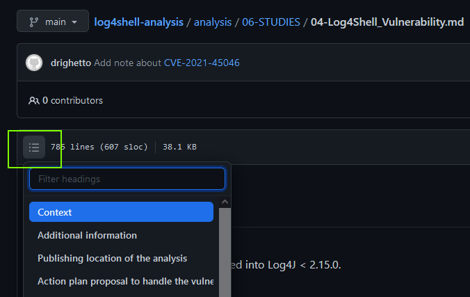

# Objective

[](https://github.com/righettod/log4shell-analysis/actions/workflows/test-detection-regex-for-bypass.yml)

Contains all my research and content produced regarding the [log4shell](https://nvd.nist.gov/vuln/detail/CVE-2021-44228) vulnerability.

# Content

## Folder "analysis"

Contain the information that I gather about the vulnerability, affected versions, exploitation context/requirements, remediation plan proposal and so on...

This content is created using [Joplin](https://joplinapp.org/) and then exported as markdown to the **analysis** folder.

➡️ [Access to the content](analysis/06-STUDIES/04-Log4Shell_Vulnerability.md).

💡 Use the **TOC feature** of Github the navigate in the content (icon on top left):



## Folder "payloads"

Contain a collection of [log4shell](https://nvd.nist.gov/vuln/detail/CVE-2021-44228) payloads seen on my twitter feeds.

The goal is to allows testing detection regexes defined in protection systems against payloads effectively used.

➡️ [Access to the content](payloads/README.md).

## Folder "playground"

Contains sample java files used to test my scripts.

Precisely, contains *log4j-core* instances of the library including ones hidden in WAR/EAR archives as well as nested jars.

The 6 files are named from `AAlog4j...` to `FFlog4j...` to faciliate the review of the test results.

## Folder "sandbox"

Contains a maven project used to perform testing with the log4j2 library as well as working on protection/detection technical material, like unit test cases.

It is a [IntelliJ IDEA](https://www.jetbrains.com/idea/download/#section=windows) project.

## Folder "scripts"

> 💡 For Windows target: You can use the **bash** provided by [Git portable for Windows](https://git-scm.com/download/win) to run all the scripts.

Contains utility script provided to help addressing this vulnerability.

* [identify-log4j-class-location.sh](scripts/identify-log4j-class-location.sh): Bash script to identify Log4J affected class for CVE-2021-44228 in a collection of EAR/WAR/JAR files.

```bash
$ bash identify-log4j-class-location.sh ../playground/
[+] Searching class 'org/apache/logging/log4j/core/lookup/JndiLookup.class' across '../playground/' folder...
[*] Inspecting file: BBlog4j - core - 2.14.1.jar                                                             
[!] Class found in the file '../playground/BBlog4j - core - 2.14.1.jar'.
[+] Try to find the Maven artefact version...
File          : ../playground/BBlog4j - core - 2.14.1.jar
Metadata file : META-INF/maven/org.apache.logging.log4j/log4j-core/pom.properties
Log4J version : 2.14.1
[*] Inspecting file: dom4j-1.1.jar
...
[!] Inspection finished - Class found!
```

* [identify-tcm-expressions-usage.sh](scripts/identify-tcm-expressions-usage.sh): Bash script to identify code prone to CVE-2021-45046/CVE-2021-45105 in a collection of EAR/WAR/JAR files.

ℹ️ A release jar file of this [java decompiler](https://github.com/intoolswetrust/jd-cli) must be present in the current folder as well as [java](https://adoptium.net/?variant=openjdk11) (JRE) in the `$PATH`.

```bash
$ bash identify-tcm-expressions-usage.sh ../playground/
[+] Include Log4J artefacts.
[+] Searching for Log4J2 Thread Context Map or Log4J2 Expressions usage across '../playground/' folder...
[*] Inspecting file: BBlog4j - core - 2.14.1.jar
[!] Usage of the Thread Context Map identified in decompiled sources of the jar file '../playground/BBlog4j - core - 2.14.1.jar':
/tmp/jarsrcwork/org/apache/logging/log4j/core/LogEvent.java:7:import org.apache.logging.log4j.ThreadContext;
/tmp/jarsrcwork/org/apache/logging/log4j/core/layout/AbstractJacksonLayout.java:19:import org.apache.logging.log4j.ThreadContext;
...
[!] Inspection finished - Usage found!
```

```bash
$ bash identify-tcm-expressions-usage.sh ../playground/ --ignore-log4j2-artefacts
[+] Exclude Log4J artefacts.
[+] Searching for Log4J2 Thread Context Map or Log4J2 Expressions usage across '../playground/' folder...
[V] Inspection finished - No usage found!
```

## Folder "videos"

Contains videos of demonstrations and technical tests performed during the analysis.

# Misc

A companion tool was developed alongside this analysis to help the defender side: [log4shell-payload-grabber](https://github.com/righettod/log4shell-payload-grabber).
